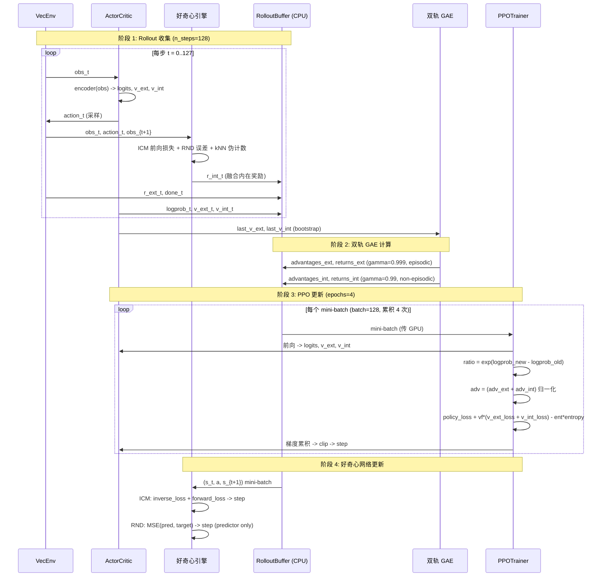
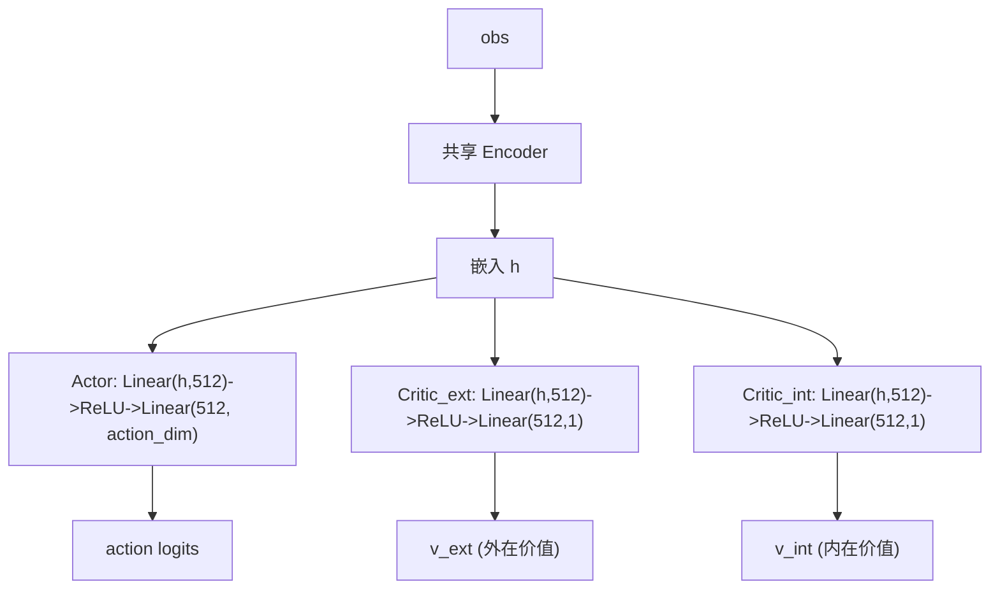

# 架构设计文档

本文档描述好奇心 PPO 智能体的系统架构、模块依赖关系、数据流、好奇心引擎融合机制、PPO 双价值头设计以及 VRAM 优化策略。

---

## 1. 系统架构总览

```mermaid
graph TB
    subgraph 环境 "环境层"
        ENV["VecEnv (8 并行)<br/>Crafter / Atari / MiniGrid"]
    end

    subgraph 策略 "策略网络 ActorCritic"
        ENC["共享 Encoder<br/>CrafterEncoder / NatureDQN"]
        ACTOR["Actor<br/>Linear -> action logits"]
        VEXT["Critic_ext<br/>外在价值头"]
        VINT["Critic_int<br/>内在价值头"]
        ENC --> ACTOR
        ENC --> VEXT
        ENC --> VINT
    end

    subgraph 好奇心 "好奇心引擎"
        ICM["ICM<br/>逆模型 + 前向模型"]
        RND["RND<br/>target + predictor"]
        EPI["Episodic Memory<br/>kNN 伪计数 (CPU)"]
        NGU["NGUFusion<br/>三信号融合"]
        ICM --> NGU
        RND --> NGU
        EPI --> NGU
    end

    subgraph PPO "PPO 训练核心"
        BUF["Rollout Buffer (CPU)"]
        GAE["双轨 GAE"]
        TRAINER["PPOTrainer<br/>AMP + 梯度累积"]
        BUF --> GAE
        GAE --> TRAINER
    end

    subgraph 工具 "工具层"
        AMP["AMPManager (FP16)"]
        VRAM["VRAM 监控"]
        CKPT["Checkpoint"]
        LOG["Logger (Wandb)"]
    end

    ENV -->|"obs"| ENC
    ACTOR -->|"action"| ENV
    ENV -->|"reward, done"| BUF
    NGU -->|"r_int"| BUF
    VEXT -->|"v_ext"| BUF
    VINT -->|"v_int"| BUF
    ENV -->|"obs"| ICM
    ENV -->|"obs"| RND
    ICM -->|"embedding"| EPI
    TRAINER -->|"更新"| ENC
    TRAINER -->|"更新"| ACTOR
    TRAINER -->|"更新"| VEXT
    TRAINER -->|"更新"| VINT
```

---

## 2. 模块依赖关系

```mermaid
graph LR
    subgraph config "配置"
        CFG["config.py<br/>PPOConfig / RNDConfig<br/>ICMConfig / EpisodicConfig"]
    end

    subgraph envs "环境"
        VE["vec_env.py"]
        WRAP["wrappers.py"]
        COMPAT["compat.py"]
        CE["crafter_env.py"]
        AE["atari_env.py"]
        ME["minigrid_env.py"]
        COMPAT --> CE
        WRAP --> CE
        WRAP --> AE
        WRAP --> ME
        VE --> CE
        VE --> AE
        VE --> ME
    end

    subgraph nets "网络"
        ENC["encoders.py"]
        POL["policy.py"]
        ICMN["icm.py"]
        RNDN["rnd.py"]
        ENC --> POL
        ENC --> ICMN
        ENC --> RNDN
    end

    subgraph curio "好奇心"
        ICMC["icm_module.py"]
        RNDC["rnd_module.py"]
        EPIM["episodic_memory.py"]
        NGUF["ngu_fusion.py"]
        RNORM["reward_norm.py"]
        ICMN --> ICMC
        RNDN --> RNDC
        RNORM --> RNDC
        EPIM --> NGUF
        ICMC --> NGUF
        RNDC --> NGUF
    end

    subgraph ppo "PPO"
        BUF["rollout_buffer.py"]
        GAEM["gae.py"]
        TRN["ppo_trainer.py"]
        AGENT["agent.py"]
        BUF --> TRN
        GAEM --> AGENT
        TRN --> AGENT
    end

    subgraph utils "工具"
        AMPM["amp.py"]
        VRAMM["vram.py"]
        MBANK["memory_bank.py"]
        CKPTM["checkpoint.py"]
        LOGM["logger.py"]
        SEED["seed.py"]
        MBANK --> EPIM
        AMPM --> TRN
    end

    CFG --> AGENT
    VE --> AGENT
    POL --> AGENT
    NGUF --> AGENT
```

### 依赖关系说明

- **config.py** 是全局配置入口, 被 agent 和所有脚本依赖。
- **encoders.py** 是网络基础, 被 policy / icm / rnd 三个网络模块依赖。
- **memory_bank.py** (LRU) 被 episodic_memory 依赖, 两者均在 CPU 运行。
- **agent.py** 是端到端集成点, 组合环境、网络、好奇心引擎、PPO 训练器。
- **amp.py** 被 ppo_trainer 和 agent 的好奇心更新共用。

---

## 3. 数据流

### 3.1 训练循环数据流



### 3.2 单步数据流详解

```
env.step(action)
  |
  v
obs (HWC) -> _to_tensor -> permute(0,3,1,2) -> obs_tensor (CHW)
  |
  +-> ActorCritic.forward(obs_tensor)
  |     encoder(obs) -> h
  |     actor(h) -> logits -> Categorical.sample() -> action
  |     critic_ext(h) -> v_ext
  |     critic_int(h) -> v_int
  |
  +-> _compute_intrinsic_reward(obs_t, action, obs_next, done)
  |     |
  |     +-> ICM: get_embedding(s_t) -> controllable_emb (phi_t)
  |     +-> NGUFusion.compute(s_t, a, s_next, controllable_emb)
  |           |
  |           +-> r_icm = eta * ICM.forward_loss
  |           +-> r_epi = 1/sqrt(kNN_pseudo_count(emb) + eps)
  |           +-> alpha = 1 + (L-1)*sigmoid(RND_normalized_error)
  |           +-> r_ngu = r_epi * min(max(alpha, 1), L)
  |           +-> return r_icm + r_ngu
  |     |
  |     +-> episodic_memory.add(controllable_emb)
  |     +-> if done: episodic_memory.reset()
  |
  +-> buffer.add(obs, action, logprob, r_ext, r_int, v_ext, v_int, done)
```

---

## 4. 好奇心引擎: ICM + RND + Episodic -> NGUFusion

### 4.1 三模块职责

```mermaid
graph TB
    subgraph ICM_mod "ICM 模块 (短时程)"
        I1["encoder phi(s_t)"] --> I2["逆模型: 预测 a"]
        I1 --> I3["前向模型: 预测 phi(s_{t+1})"]
        I3 --> I4["r_icm = eta * MSE"]
        I1 --> I5["phi_t -> 情景记忆 embedding"]
    end

    subgraph RND_mod "RND 模块 (长时程)"
        R1["target(s) 固定"] --> R3["MSE 误差"]
        R2["predictor(s) 可训练"] --> R3
        R3 --> R4["归一化 -> r_rnd"]
        R3 --> R5["归一化 -> sigmoid -> alpha_t"]
    end

    subgraph EPI_mod "Episodic Memory (中时程)"
        E1["LRU 内存库 (CPU)"] --> E2["kNN 距离 -> 伪计数 N(x)"]
        E2 --> E3["r_epi = 1/sqrt(N+eps)"]
        E1 -.->|"done 时 reset"| E4["清空"]
    end

    I4 --> NGU["NGUFusion"]
    I5 --> E1
    E3 --> NGU
    R5 --> NGU
    R4 --> NGU
    NGU --> OUT["r_int = r_icm + r_ngu"]
```

### 4.2 NGUFusion 融合逻辑

`NGUFusion.compute()` 根据配置开关动态选择融合路径:

```python
# src/curiosity_ppo/curiosity/ngu_fusion.py

# 1. ICM 前向好奇心 (短时程)
if config.icm.enabled and icm:
    r_icm = icm.compute_reward(s_t, a, s_next)   # eta * forward_loss
else:
    r_icm = 0.0

# 2. NGU 情景 + 长期融合
if config.episodic.enabled and episodic and controllable_emb is not None:
    r_epi = episodic.compute_reward(controllable_emb)          # 1/sqrt(N+eps)
    if config.rnd.enabled and rnd:
        alpha = rnd.compute_alpha(s_next)                      # 1+(L-1)*sigmoid(err)
    else:
        alpha = 1.0
    r_ngu = r_epi * min(max(alpha, 1.0), L)
elif config.rnd.enabled and rnd:
    r_ngu = rnd.compute_reward(s_next)                         # 纯 RND 奖励
else:
    r_ngu = 0.0

return r_icm + r_ngu
```

### 4.3 时间尺度分工

| 模块 | 时间尺度 | 记忆周期 | 作用 |
|------|----------|----------|------|
| ICM 前向预测 | 短 | 无 (即时) | 对未预测的状态转移给予即时好奇心 |
| Episodic kNN | 中 | episode 内 (done 时清空) | 防止 episode 内重复访问 |
| RND alpha_t | 长 | 跨 episode (持久) | 调制情景奖励, 长期已知区域降低探索 |

---

## 5. PPO 双价值头设计

### 5.1 双价值头结构



### 5.2 双轨 GAE 计算

外在价值与内在价值使用不同的 gamma 和 done 处理:

```python
# src/curiosity_ppo/ppo/gae.py + agent.py

# 外在 GAE (episodic): done 处截断, gamma_ext=0.999
adv_ext, ret_ext = compute_gae(
    rewards=buffer.rewards_ext,
    values=buffer.values_ext,
    last_value=last_v_ext,
    dones=buffer.dones,           # 真实 done, episode 边界截断
    gamma=0.999,
    gae_lambda=0.95,
)

# 内在 GAE (non-episodic): done 全 0, gamma_int=0.99, 跨 episode
dones_int = np.zeros_like(buffer.dones)   # 不截断!
adv_int, ret_int = compute_gae(
    rewards=buffer.rewards_int,
    values=buffer.values_int,
    last_value=last_v_int,
    dones=dones_int,              # 全 0, 内在回报跨 episode 累积
    gamma=0.99,
    gae_lambda=0.95,
)
```

### 5.3 优势合并与损失

PPO 更新时, 双轨优势相加后归一化:

```python
# src/curiosity_ppo/ppo/ppo_trainer.py

# 双轨优势分别归一化后合并
# ext 用 gamma=0.999, int 用 gamma=0.99, 尺度差异大
# 分别归一化确保两路信号都不被对方淹没
adv_ext = (adv_ext - adv_ext.mean()) / (adv_ext.std() + 1e-8)
adv_int = (adv_int - adv_int.mean()) / (adv_int.std() + 1e-8)
advantages = adv_ext + adv_int

# PPO clipped objective
ratio = torch.exp(logprobs_new - logprobs_old)
surr1 = ratio * advantages
surr2 = torch.clamp(ratio, 1-clip, 1+clip) * advantages
policy_loss = -torch.min(surr1, surr2).mean()

# 双价值损失
v_ext_loss = 0.5 * ((v_ext - returns_ext) ** 2).mean()
v_int_loss = 0.5 * ((v_int - returns_int) ** 2).mean()

loss = policy_loss + vf_coef * (v_ext_loss + v_int_loss) - ent_coef * entropy
```

### 5.4 设计要点

- **gamma_ext=0.999 (高)**: 外在奖励稀疏, 需要长视野规划, gamma 接近 1。
- **gamma_int=0.99 (略低)**: 内在奖励需要一定衰减, 避免无限累积; 但仍跨 episode (non-episodic)。
- **done 截断差异**: 外在 GAE 在 episode 边界截断 (符合 episodic RL); 内在 GAE 不截断 (符合 RND 的 non-episodic 设计)。
- **优势合并**: `adv_ext + adv_int` 后统一归一化, 简化 PPO 更新, 避免双优化器的复杂度。

---

## 6. VRAM 优化策略

```mermaid
graph TB
    subgraph GPU "GPU VRAM (~2.2GB 峰值)"
        PARAM["模型参数 + 梯度 + Adam<br/>ActorCritic + ICM + RND"]
        ACT["FP16 激活值<br/>torch.autocast 节省 40%"]
        MINI["mini-batch 临时张量<br/>用完即释放"]
    end

    subgraph CPU "CPU RAM (~140MB)"
        RBUF["Rollout Buffer<br/>numpy, 128x8 观测"]
        LRU["LRU 内存库<br/>numpy, 10000x512"]
        GAE_C["GAE 计算中间量"]
    end

    subgraph AMP "AMP 机制"
        AC["autocast (前向 FP16)"]
        SC["GradScaler (梯度放大)"]
        UNSC["unscale (裁剪前还原)"]
    end

    RBUF -->|"mini-batch .to(device)"| MINI
    LRU -.->|"kNN 搜索在 CPU"| GAE_C
    AC --> ACT
    SC --> PARAM
    UNSC --> PARAM
```

### 优化策略汇总

| 策略 | 机制 | 节省 | 位置 |
|------|------|------|------|
| FP16 AMP | autocast + GradScaler | 激活减 40% | `utils/amp.py` |
| 梯度累积 | batch=128x4=512, 峰值不增 | 避免 4x 峰值 | `ppo/ppo_trainer.py` |
| CPU Rollout Buffer | numpy 存储, mini-batch 传 GPU | ~80MB VRAM | `ppo/rollout_buffer.py` |
| CPU LRU 内存库 | numpy kNN, 零 VRAM | ~20MB VRAM | `utils/memory_bank.py` |
| 每步 empty_cache | 释放 CUDA 缓存碎片 | 减少碎片 | `ppo/agent.py` |

详见 `docs/VRAM_OPTIMIZATION.md`。

---

## 7. 编码器选择策略

根据环境名称自动选择编码器:

```python
# src/curiosity_ppo/ppo/agent.py
env_name = config.env.name.lower()
if 'crafter' in env_name or 'minigrid' in env_name:
    encoder = CrafterEncoder(in_channels, out_dim=config.icm.feature_dim)  # 288 维
    embed_dim = config.icm.feature_dim
    rnd_encoder_cls = CrafterEncoder
else:
    encoder = NatureDQNEncoder(in_channels, out_dim=512)  # Atari
    embed_dim = 512
    rnd_encoder_cls = NatureDQNEncoder
```

| 环境 | 编码器 | 输入 | 输出维度 | 用途 |
|------|--------|------|----------|------|
| Crafter | CrafterEncoder | 3x64x64 | 288 | 策略 + ICM + RND |
| MiniGrid | CrafterEncoder | 3x64x64 | 288 | 策略 + ICM + RND |
| Atari | NatureDQNEncoder | 4x84x84 | 512 | 策略 + RND; ICM 也用 CrafterEncoder |

### CrafterEncoder 结构

```
Conv2d(3, 32, 3, padding=1) -> ReLU -> MaxPool2d(2)   # 64->32
Conv2d(32, 32, 3, padding=1) -> ReLU -> MaxPool2d(2)  # 32->16
Conv2d(32, 32, 3, padding=1) -> ReLU -> MaxPool2d(2)  # 16->8
Conv2d(32, 32, 3, padding=1) -> ReLU -> MaxPool2d(2)  # 8->4
Flatten -> Linear(32*4*4, 288)
```

### NatureDQNEncoder 结构

```
Conv2d(4, 32, 8, stride=4) -> ReLU    # 84->20
Conv2d(32, 64, 4, stride=2) -> ReLU   # 20->9
Conv2d(64, 64, 3, stride=1) -> ReLU   # 9->7
Flatten -> Linear(64*7*7, 512) -> ReLU
```

---

## 8. 训练状态管理与检查点

```mermaid
graph LR
    subgraph 保存 "save_checkpoint"
        AC["actor_critic.state_dict()"]
        OPT["ppo_optimizer.state_dict()"]
        ICM_S["icm_net.state_dict()"]
        RND_S["rnd_net.state_dict()"]
        META["extra: step, metrics"]
    end
    AC --> CKPT["checkpoint .pt"]
    OPT --> CKPT
    ICM_S --> CKPT
    RND_S --> CKPT
    META --> CKPT

    CKPT --> LOAD["load_checkpoint"]
    LOAD --> AC2["恢复 actor_critic"]
    LOAD --> OPT2["恢复 optimizer"]
    LOAD --> ICM2["恢复 icm_net"]
    LOAD --> RND2["恢复 rnd_net"]
    LOAD --> STEP["恢复 global_step"]
```

检查点保存内容:

- `actor_critic`: 策略网络权重 (encoder + actor + 双 critic)
- `ppo_optimizer`: PPO 优化器状态
- `icm_net`: ICM 网络权重 (若启用)
- `rnd_net`: RND 网络权重 (若启用)
- `extra`: global_step, metrics 快照

> 参见: `src/curiosity_ppo/utils/checkpoint.py` 与 `ppo/agent.py` 的 `save()` / `load()`。

---

## 9. 关键设计决策总结

| 决策 | 选择 | 理由 |
|------|------|------|
| 好奇心融合方式 | r_icm + r_ngu (加法) | ICM 与 NGU 信号尺度独立, 加法避免乘法尺度耦合 |
| 双价值头 | 共享 encoder + 独立 critic | 编码器复用节省参数, 双头分离 ext/int 价值估计 |
| GAE 双轨 | ext episodic + int non-episodic | 遵循 RND/NGU 设计, 内在回报跨 episode 累积 |
| 优势合并 | adv_ext + adv_int 后归一化 | 简化 PPO 更新, 单优化器 |
| Embedding 来源 | ICM encoder (回退 RND target) | ICM 可控性过滤提升 kNN 质量 |
| alpha_t 映射 | 1 + (L-1)*sigmoid(error) | 平滑映射到 [1,L], 避免硬阈值 |
| 记忆库位置 | CPU (numpy LRU) | 零 VRAM 占用, kNN 开销可接受 |
| Rollout buffer 位置 | CPU (numpy) | 节省 ~80MB VRAM, mini-batch 传 GPU |
| 精度策略 | FP16 AMP | 节省 40% 激活, Tensor Core 加速 |
| 大 batch 实现 | 梯度累积 128x4=512 | 峰值 VRAM 不增加, 等效大 batch |
