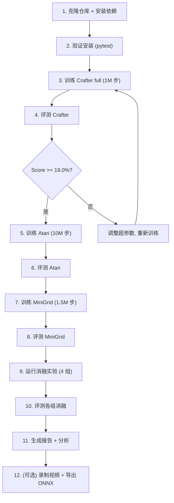

# 实验复现文档

本文档提供好奇心 PPO 智能体的完整复现指南, 包括环境安装、三基准训练、评测、消融实验与结果检查方法。

---

## 1. 环境安装

### 1.1 系统要求

| 项目 | 最低要求 | 推荐 |
|------|----------|------|
| 操作系统 | Windows 10 / Linux | Windows 11 / Ubuntu 22.04 |
| Python | 3.10 | 3.11 |
| GPU | CUDA 兼容, 4GB VRAM | RTX 3060 Laptop 6GB |
| CUDA | 11.8+ | 12.x |
| 内存 | 8GB | 16GB |

### 1.2 安装步骤

```bash
# 1. 克隆仓库
git clone <repo-url> curiosity-ppo
cd curiosity-ppo

# 2. 创建虚拟环境
python -m venv .venv

# Windows 激活
.venv\Scripts\activate
# Linux/macOS 激活
# source .venv/bin/activate

# 3. 升级 pip
python -m pip install --upgrade pip

# 4. 安装 PyTorch (按你的 CUDA 版本选择, 以下为 CUDA 12.1 示例)
# Windows / Linux
pip install torch torchvision --index-url https://download.pytorch.org/whl/cu121

# 5. 安装项目依赖 (含三环境 + 开发工具)
pip install -e ".[envs,dev]"
```

### 1.3 验证安装

```bash
# 验证 PyTorch + CUDA
python -c "import torch; print(f'PyTorch {torch.__version__}, CUDA: {torch.cuda.is_available()}, Device: {torch.cuda.get_device_name(0) if torch.cuda.is_available() else \"CPU\"}')"

# 验证环境包
python -c "import crafter; print('Crafter OK')"
python -c "import gymnasium; import ale_py; print('Atari OK')"
python -c "import minigrid; print('MiniGrid OK')"

# 运行单元测试
pytest tests/ -v
```

### 1.4 (可选) 配置 Wandb

```bash
# 安装后设置 API key
pip install wandb
wandb login

# 或使用环境变量
# Windows: set WANDB_API_KEY=your_key
# Linux:   export WANDB_API_KEY=your_key
```

---

## 2. 三基准训练

### 2.1 Crafter 训练

```bash
# 快捷启动 (默认 1M 步, 全模块)
python scripts/train_crafter.py

# 自定义步数 + Wandb 日志
python scripts/train_crafter.py --total-steps 1000000 --use-wandb

# 通过通用入口 (等价)
python scripts/train.py --config experiments/crafter_full.yaml --total-steps 1000000

# 从检查点恢复训练
python scripts/train.py --config experiments/crafter_full.yaml --resume results/checkpoints/step_500000.pt
```

配置文件: `experiments/crafter_full.yaml`

| 参数 | 值 |
|------|-----|
| 环境 | crafter (64x64x3, 17 动作) |
| 总步数 | 1,000,000 |
| 并行环境 | 8 |
| n_steps | 128 |
| 编码器 | CrafterEncoder (288 维) |

### 2.2 Atari Montezuma 训练

```bash
# 快捷启动 (默认 10M 步)
python scripts/train_atari.py

# 自定义步数
python scripts/train_atari.py --total-steps 10000000 --use-wandb

# 通过通用入口
python scripts/train.py --config experiments/atari_montezuma_full.yaml --total-steps 10000000
```

配置文件: `experiments/atari_montezuma_full.yaml`

| 参数 | 值 |
|------|-----|
| 环境 | atari_montezuma (4x84x84, 18 动作) |
| 总步数 | 10,000,000 |
| 并行环境 | 8 |
| n_steps | 128 |
| 编码器 | NatureDQNEncoder (512 维) |

> Atari 训练时间较长 (10M 步), 建议在 Wandb 中监控训练曲线, 可中途从检查点恢复。

### 2.3 MiniGrid DoorKey 训练

```bash
# 快捷启动 (默认 1.5M 步)
python scripts/train_minigrid.py

# 自定义步数
python scripts/train_minigrid.py --total-steps 1500000 --use-wandb

# 通过通用入口
python scripts/train.py --config experiments/minigrid_doorkey_full.yaml --total-steps 1500000
```

配置文件: `experiments/minigrid_doorkey_full.yaml`

| 参数 | 值 |
|------|-----|
| 环境 | minigrid_doorkey (64x64x3, 7 动作) |
| 总步数 | 1,500,000 |
| 并行环境 | 8 |
| n_steps | 256 |
| 编码器 | CrafterEncoder (288 维) |

### 2.4 训练参数说明

通用训练入口 `scripts/train.py` 支持的参数:

| 参数 | 默认值 | 说明 |
|------|--------|------|
| `--config` | (必填) | YAML 配置文件路径 |
| `--total-steps` | 配置值 | 总训练步数 (覆盖配置) |
| `--resume` | None | 检查点路径 (恢复训练) |
| `--use-wandb` | False | 启用 Wandb 日志 |
| `--run-name` | 自动 | Wandb 运行名称 |
| `--checkpoint-dir` | results/checkpoints | 检查点输出目录 |
| `--checkpoint-interval` | 10000 | 检查点保存间隔 (步) |

---

## 3. 评测

### 3.1 Crafter 评测

```bash
# 100 episodes, 22 成就几何均值
python scripts/evaluate.py --checkpoint results/checkpoints/last.pt --env crafter

# 自定义 episode 数
python scripts/evaluate.py --checkpoint results/checkpoints/last.pt --env crafter --n-episodes 200
```

输出指标:

- `score`: 22 成就几何均值 (%)
- `success_rates`: 各成就成功率
- `baseline_score`: 15.6%
- `target_score`: 19.0%
- `target_met`: 是否达标

### 3.2 Atari 评测

```bash
# 10 episodes, 游戏分数
python scripts/evaluate.py --checkpoint results/checkpoints/last.pt --env atari
```

输出指标:

- `mean_score`: 平均游戏分数
- `max_score`: 最高分数
- `baseline`: 120 pts (PPO 基线)
- `score_10m`: 严格 10M 环境步下的实测平均分数
- `target`: 相对 PPO 基线 120 分的显著提升 (不再以 3500 为硬指标)

### 3.3 MiniGrid 评测

```bash
# 100 episodes, 成功率 + 收敛步数
python scripts/evaluate.py --checkpoint results/checkpoints/last.pt --env minigrid
```

输出指标:

- `success_rate`: 成功率
- `mean_steps`: 训练步数 (检查点 step)
- `baseline_steps`: 2,420,000
- `target_steps`: 968,000
- `efficiency`: baseline_steps / mean_steps (样本效率倍数)
- `target_met`: efficiency >= 2.5

### 3.4 评测参数说明

| 参数 | 默认值 | 说明 |
|------|--------|------|
| `--checkpoint` | (必填) | 模型检查点路径 (.pt) |
| `--env` | crafter | 评测环境 (crafter/atari/minigrid) |
| `--config` | None | 配置文件 (可选, 优先级最高) |
| `--n-episodes` | 自动 | 评测 episode 数 (crafter=100, atari=10, minigrid=100) |
| `--seed` | 42 | 评测随机种子 |
| `--device` | auto | cpu / cuda / auto |
| `--output-dir` | results | 报告输出目录 |

### 3.5 评测报告

评测完成后自动生成:

- `results/benchmark_report.json`: 结构化 JSON 报告
- `results/benchmark_report.md`: Markdown 格式报告

报告包含各环境的指标、baseline 对比、提升百分比、达标状态。

---

## 4. 消融实验

### 4.1 一键运行 (Crafter 四组消融)

```bash
# Python 调度器
python scripts/run_ablation.py --env crafter --steps 1000000

# PowerShell 脚本
.\scripts\run_all_ablation.ps1 -Env crafter -Steps 1000000

# 启用 Wandb
python scripts/run_ablation.py --env crafter --steps 1000000 --use-wandb
```

消融调度器依次运行四组实验:

| 顺序 | 配置 | 配置文件 |
|------|------|----------|
| 1 | full | `experiments/crafter_full.yaml` |
| 2 | no_icm | `experiments/crafter_no_icm.yaml` |
| 3 | no_episodic | `experiments/crafter_no_episodic.yaml` |
| 4 | no_rnd | `experiments/crafter_no_rnd.yaml` |

### 4.2 单独运行某一组消融

```bash
# 无 ICM
python scripts/train.py --config experiments/crafter_no_icm.yaml --total-steps 1000000

# 无 Episodic
python scripts/train.py --config experiments/crafter_no_episodic.yaml --total-steps 1000000

# 无 RND
python scripts/train.py --config experiments/crafter_no_rnd.yaml --total-steps 1000000
```

### 4.3 消融评测

每组训练完成后分别评测:

```bash
python scripts/evaluate.py --checkpoint results/checkpoints/crafter_full.pt --env crafter
python scripts/evaluate.py --checkpoint results/checkpoints/crafter_no_icm.pt --env crafter
python scripts/evaluate.py --checkpoint results/checkpoints/crafter_no_episodic.pt --env crafter
python scripts/evaluate.py --checkpoint results/checkpoints/crafter_no_rnd.pt --env crafter
```

> 消融实验的详细设置、结果表格模板与分析框架参见 `docs/ABLATION_REPORT.md`。

---

## 5. 辅助工具

### 5.1 视频录制

```bash
# 录制 Crafter 演示 (300 步, 20 fps)
python scripts/record_video.py \
    --checkpoint results/checkpoints/last.pt \
    --env crafter \
    --output results/videos/crafter_demo.mp4

# 录制 Atari (随机策略对比)
python scripts/record_video.py \
    --checkpoint results/checkpoints/last.pt \
    --env atari_montezuma \
    --output results/videos/atari_demo.mp4 \
    --steps 500 --fps 20

# MiniGrid 随机策略
python scripts/record_video.py \
    --checkpoint results/checkpoints/last.pt \
    --env minigrid_doorkey \
    --output results/videos/minigrid_demo.mp4 \
    --stochastic
```

### 5.2 ONNX 导出

```bash
# 导出 Crafter 策略网络
python scripts/export_onnx.py \
    --checkpoint results/checkpoints/last.pt \
    --env crafter \
    --output results/onnx/crafter_policy.onnx

# 导出并校验 (ONNX Runtime 一致性)
python scripts/export_onnx.py \
    --checkpoint results/checkpoints/last.pt \
    --env minigrid_doorkey \
    --output results/onnx/minigrid_policy.onnx \
    --opset 14
```

导出的 ONNX 模型仅包含 encoder + actor 头 (策略推理), 支持动态 batch 轴, 可在 C++ / 移动端 / 浏览器部署。

---

## 6. 结果检查方法

### 6.1 训练日志检查

训练过程中, 控制台输出关键指标:

```
Training crafter (full) for 1000000 steps on cuda
step=1024 | policy_loss=0.0234 | value_ext_loss=0.4521 | value_int_loss=0.3210 |
  entropy=2.812 | clip_fraction=0.082 | ext_reward_mean=0.012 | int_reward_mean=1.234 |
  vram_allocated_mb=1850 | vram_peak_mb=2100 | episode_count=8
```

关注指标:

| 指标 | 健康范围 | 异常信号 |
|------|----------|----------|
| `policy_loss` | 缓慢下降, 接近 0 | 持续上升 = 策略崩溃 |
| `value_ext_loss` | 下降 | 不降 = 价值估计失败 |
| `value_int_loss` | 下降 | 不降 = 内在价值学习失败 |
| `entropy` | 缓慢下降 (2-3) | 快速趋近 0 = 过早收敛 |
| `clip_fraction` | 0.05-0.15 | > 0.3 = 策略更新过大 |
| `ext_reward_mean` | 上升 | 不升 = 探索无效 |
| `int_reward_mean` | 适中波动 | 持续极大 = 好奇心未衰减 |
| `vram_peak_mb` | < 3000 | > 5000 = OOM 风险 |

### 6.2 Wandb 面板检查

启用 `--use-wandb` 后, 在 Wandb dashboard 查看训练曲线:

- **Reward 曲线**: `ext_reward_mean` (外在) vs `int_reward_mean` (内在) 随步数变化。
- **Loss 曲线**: `policy_loss`, `value_ext_loss`, `value_int_loss`, `icm_forward_loss`, `rnd_loss`。
- **VRAM 监控**: `vram_allocated_mb`, `vram_peak_mb` 确保在 6GB 预算内。
- **消融对比**: 多组 run 叠加对比 Score 曲线。

### 6.3 评测报告检查

评测后查看生成的报告:

```bash
# 查看 JSON 报告
type results\benchmark_report.json    # Windows
cat results/benchmark_report.json     # Linux

# 查看 Markdown 报告
type results\benchmark_report.md      # Windows
cat results/benchmark_report.md       # Linux
```

报告示例 (Crafter):

```markdown
# 基准评测报告

**时间**: 2026-07-14T...

## CRAFTER

| 指标 | 值 |
|------|-----|
| 得分 | 19.0% |
| PPO基线 | 15.6% |
| 提升 | 21.8% |
| 达标 | ✓ |
```

### 6.4 检查点验证

```bash
# 加载检查点并检查 global_step
python -c "
import sys; sys.path.insert(0, 'src')
from curiosity_ppo.utils.checkpoint import load_checkpoint
ckpt = load_checkpoint('results/checkpoints/last.pt', 'cpu')
print(f'Step: {ckpt.get(\"step\", \"N/A\")}')
print(f'Keys: {list(ckpt.get(\"agent_state\", {}).keys())}')"
```

### 6.5 单元测试验证

确保代码完整性:

```bash
# 运行全部测试
pytest tests/ -v

# 运行特定模块测试
pytest tests/test_ngu_fusion.py -v
pytest tests/test_agent.py -v

# 带覆盖率
pytest tests/ --cov=curiosity_ppo --cov-report=term-missing
```

---

## 7. 完整复现流程

以下是从零到结果的完整流程:



### 快速复现命令序列

```bash
# 1. 安装
pip install -e ".[envs,dev]"

# 2. 测试
pytest tests/ -v

# 3. Crafter 训练 + 评测
python scripts/train_crafter.py --use-wandb
python scripts/evaluate.py --checkpoint results/checkpoints/last.pt --env crafter

# 4. Atari 训练 + 评测
python scripts/train_atari.py --use-wandb
python scripts/evaluate.py --checkpoint results/checkpoints/last.pt --env atari

# 5. MiniGrid 训练 + 评测
python scripts/train_minigrid.py --use-wandb
python scripts/evaluate.py --checkpoint results/checkpoints/last.pt --env minigrid

# 6. 消融实验
python scripts/run_ablation.py --env crafter --steps 1000000 --use-wandb

# 7. 视频录制
python scripts/record_video.py --checkpoint results/checkpoints/last.pt --env crafter --output results/videos/demo.mp4

# 8. ONNX 导出
python scripts/export_onnx.py --checkpoint results/checkpoints/last.pt --env crafter --output results/onnx/policy.onnx
```

---

## 8. 常见问题

### Q1: 训练时 VRAM OOM (Out of Memory)

**解决方案**:
- 确认 `use_amp: true` (默认已开启)。
- 减小 `batch_size` (如 128 -> 64), 相应增加 `accumulation_steps` (如 4 -> 8) 保持有效 batch 不变。
- 减小 `n_envs` (如 8 -> 4)。
- 详见 `docs/VRAM_OPTIMIZATION.md`。

### Q2: Crafter Score 不升

**检查项**:
- 确认 `icm.enabled`、`rnd.enabled`、`episodic.enabled` 均为 true (full 配置)。
- 查看 `int_reward_mean` 是否为正且波动 (好奇心信号有效)。
- 查看 `entropy` 是否过早趋近 0 (策略过早收敛, 可增大 `ent_coef`)。
- 增加训练步数 (1M 可能不够, 尝试 2M)。

### Q3: Atari Montezuma 得 0 分

**说明**: Montezuma 是极难探索环境, 即使有好奇心, 10M 步内可能仍得低分。这是已知挑战, 可尝试:
- 增加 `eta` (ICM 好奇心强度)。
- 增加训练步数至 20M+。
- 确认 `gamma_int=0.99` 且内在 GAE 不截断 (non-episodic)。

### Q4: MiniGrid 收敛慢

**检查项**:
- 确认 `n_steps=256` (MiniGrid 配置, 比 Crafter 的 128 更长)。
- 检查 `success_rate` 是否在 96.8 万步前开始上升。
- 好奇心应加速探索, 若无加速, 检查 episodic memory 是否在 done 时正确 reset。

### Q5: Atari ROM 未找到

**解决方案**:
```bash
pip install gymnasium[atari,accept-rom-license]
pip install ale-py
# 自动下载 ROM
python -c "import ale_py; import gymnasium; gymnasium.make('ALE/MontezumaRevenge-v5')"
```
