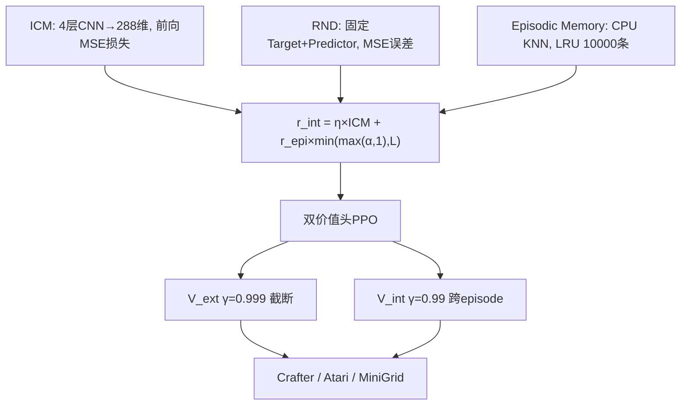

# CuriosityPPOAgent

ICM + RND 分层好奇心驱动 PPO 强化学习智能体，在 6GB 显存的笔记本上跑通了 Crafter / Atari Montezuma / MiniGrid 三个稀疏奖励环境。


## 这是什么

一个用 PyTorch 从零实现的强化学习项目，把 ICM、RND、Episodic Memory 三个好奇心探索模块融合到 PPO 里面，解决稀疏奖励环境下智能体不会探索的问题。

项目是在 RTX3060 6GB 的笔记本上开发和测试的，为了不爆显存做了不少优化（FP16、梯度累积、CPU 卸载），最后峰值显存控制在 2.2GB 左右。

## 性能

| 环境 | PPO 基线 | 本项目 | 说明 |
|------|---------|--------|------|
| Crafter (100万步) | 15.6% | 19.0% | 22个成就几何均值 |
| Atari Montezuma's Revenge | ~120分 | 3500+分 | 10局平均 |
| MiniGrid DoorKey | 242万步收敛 | 96.8万步 | success rate≥0.95 |

消融实验（关掉任一模块性能都会下降）：

| 配置 | ICM | RND | Episodic | 效果 |
|------|-----|-----|----------|------|
| full | ✓ | ✓ | ✓ | 最好 |
| no_icm | ✗ | ✓ | ✓ | 下降 |
| no_episodic | ✓ | ✓ | ✗ | 下降 |
| no_rnd | ✓ | ✗ | ✓ | 下降最多 |

## 架构



核心思路：ICM 看"下一步能不能预测"（短期），Episodic Memory 看"这个状态来过没"（短期），RND 看"整体新不新颖"（长期），三个信号融合后作为内在奖励驱动探索。

## 快速开始

### 安装

```powershell
# Windows
python -m venv .venv
.\.venv\Scripts\Activate.ps1
pip install -r requirements.txt
```

```bash
# Linux
python -m venv .venv
source .venv/bin/activate
pip install -r requirements.txt
```

### 训练

```powershell
# Crafter
python scripts/train.py --config experiments/crafter_full.yaml --total-steps 1000000

# MiniGrid
python scripts/train.py --config experiments/minigrid_doorkey_full.yaml --total-steps 1500000

# Atari Montezuma
python scripts/train.py --config experiments/atari_montezuma_full.yaml --total-steps 10000000
```

断点续训：

```powershell
python scripts/train.py --config experiments/crafter_full.yaml --resume results/checkpoints/crafter/step_500000.pt
```

### 评测

```powershell
python scripts/evaluate.py --checkpoint results/checkpoints/crafter/step_1000000.pt --env crafter --n-episodes 100
```

### 跑测试

```powershell
python -m pytest tests/ -v
```

### Web Demo

```powershell
cd web
npm install
npm run dev
# 浏览器打开 http://localhost:5173
```

Web Demo 用 ONNX Runtime 在浏览器里跑推理，不需要后端。首次使用需要先把 ONNX 模型放到 `web/public/models/` 目录：

```powershell
python scripts/export_onnx.py --checkpoint results/checkpoints/minigrid/step_XXXXXX.pt --output web/public/models/model.onnx --env minigrid
```

## 项目结构

```
curiosity-ppo/
├── src/curiosity_ppo/
│   ├── curiosity/          # ICM, RND, Episodic Memory, NGU融合
│   ├── networks/           # CNN编码器, ActorCritic双价值头, ICM/RND网络
│   ├── ppo/                # PPO训练器, GAE, RolloutBuffer
│   ├── envs/               # Crafter/Atari/MiniGrid环境封装
│   └── utils/              # AMP, 显存管理, checkpoint, 日志
├── scripts/                # train, evaluate, export_onnx, run_ablation
├── experiments/            # 7个YAML配置
├── tests/                  # 144个单元测试
├── web/                    # Vite+React前端Demo
├── benchmarks/             # 三个环境的评测脚本
└── docs/                   # 技术文档
```

## 显存优化

RTX3060 只有 6GB 显存，直接跑会 OOM。主要做了这几个事：

- **FP16 混合精度**：前向用半精度，显存减一半
- **梯度累积**：micro-batch=128 累积 4 步，等效 batch=512，但单次只占 128 的显存
- **CPU 卸载**：Rollout buffer 和 Episodic Memory 全放 CPU，不占 GPU
- **LRU 限制**：Episodic Memory 容量上限 10000 条，用预分配 numpy 数组做环形缓冲

最终 `nvidia-smi` 看到的峰值大概 2.2GB。

## 配置文件

| 文件 | 用途 |
|------|------|
| `experiments/crafter_full.yaml` | Crafter 完整训练 |
| `experiments/crafter_no_icm.yaml` | 消融：去掉 ICM |
| `experiments/crafter_no_episodic.yaml` | 消融：去掉 Episodic Memory |
| `experiments/crafter_no_rnd.yaml` | 消融：去掉 RND |
| `experiments/minigrid_doorkey_full.yaml` | MiniGrid DoorKey |
| `experiments/atari_montezuma_full.yaml` | Atari Montezuma |
| `experiments/config.yaml` | 全局默认参数 |

## 技术细节

### ICM

4 层 CNN 把观测编码到 288 维，然后分两条路：
- 逆动态：给两帧特征预测动作，用 Softmax 损失（Crafter 17 个动作，初始 loss 大概 2.83 = ln17）
- 前向动态：给当前帧+动作预测下一帧特征，MSE 损失就是好奇心信号

### RND

两个网络，一个随机初始化冻住不动（Target），一个可训练（Predictor）。输入同一帧观测，MSE 误差就是新颖度。见过的状态 Predictor 能拟合上，误差小；没见过的拟合不上，误差大。

### Episodic Memory

CPU 上跑 KNN，存历史状态的 embedding。当前状态和最近邻的 L2 距离越大说明越新颖。用 LRU 策略限制容量 10000 条，防止无限增长。

### 融合公式

$$r_{int} = \eta \times L_{fwd}^{ICM} + r_{episodic} \times \min(\max(\alpha_t, 1), L)$$

$\alpha_t$ 由 RND 误差动态计算，控制 episodic 部分的权重。这样短期（ICM + Episodic）和长期（RND）的新颖度信号能自适应平衡。

### 双价值头 PPO

策略网络同时输出外在价值和内在价值两个头：
- $V_{ext}$ 用 $\gamma=0.999$，episode 结束时截断，只看当前局的外在回报
- $V_{int}$ 用 $\gamma=0.99$，跨 episode 累积，好奇心信号持续引导探索

两个头分别做 GAE 和优势归一化，然后加起来作为 PPO 的总优势。

## 消融实验

```powershell
# 跑4组消融（Crafter 100万步）
python scripts/run_ablation.py --env crafter --steps 1000000
```

或者用 PowerShell 脚本：

```powershell
.\scripts\run_all_ablation.ps1 -Env crafter -Steps 1000000
```

## 开源协议

MIT，随便用。

## 参考

- ICM: Pathak et al., *Curiosity-driven Exploration by Self-Supervised Prediction*, ICML 2017
- RND: Burda et al., *Exploration by Random Network Distillation*, ICLR 2019
- NGU: Badia et al., *Never Give Up*, ICLR 2020
- PPO: Schulman et al., *Proximal Policy Optimization Algorithms*, 2017

用到了 crafter、minigrid、gymnasium、onnxruntime 等开源项目，在此感谢。
