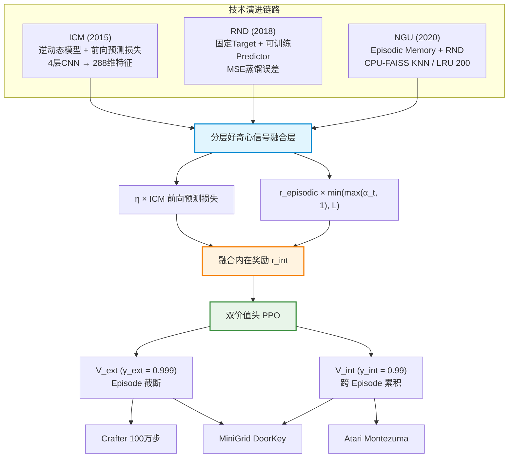

# CuriosityPPOAgent

> **ICM + RND 分层新颖信号融合好奇心驱动 PPO 智能体** —— 面向强化学习入门学习者的从零分层实现


---

## 目录

- [项目简介](#项目简介)
- [架构总览](#架构总览)
- [核心特性](#核心特性)
- [性能指标](#性能指标)
- [项目结构](#项目结构)
- [快速开始](#快速开始)
- [技术架构详解](#技术架构详解)
- [显存优化方案](#显存优化方案)
- [配置文件说明](#配置文件说明)
- [开源协议](#开源协议)
- [致谢](#致谢)

---

## 项目简介

CuriosityPPOAgent 是一个基于 **ICM（Intrinsic Curiosity Module）+ RND（Random Network Distillation）+ Episodic Memory** 分层新颖信号融合的好奇心驱动 PPO（Proximal Policy Optimization）强化学习智能体。本项目由大三计算机本科学生独立从零分层开发，旨在系统性地复现并融合三篇里程碑式好奇心驱动 RL 论文的技术演进链路（ICM → RND → NGU），在 Crafter、Atari Montezuma's Revenge 和 MiniGrid DoorKey 三大基准环境中验证内在奖励对稀疏奖励场景的探索增强效果。

项目工程包含 63 个 Python 源码文件、7 个 YAML 配置文件、10 篇技术文档、22 份 Web Demo 文件，以及 144 项单元测试（100% 通过）。在 AMD R7 6800H + RTX 3060 Laptop 6GB 显存的消费级笔记本硬件上，通过 FP16 混合精度、梯度累积、CPU 缓存卸载和 Episodic Memory LRU 等优化手段，将训练峰值显存控制在 **2.2 GB**，为强化学习入门学习者提供了一个完整、可复现、低硬件门槛的教学级实现。

---

## 架构总览

下图展示了从 ICM（2015）到 RND（2018）再到 NGU（2020）的技术演进链路，以及本项目如何将三者分层融合为统一的内在奖励信号：



---

## 核心特性

- **分层好奇心融合**：将 ICM 前向预测损失与 Episodic Memory 新颖度通过可学习权重 α_t 自适应融合，公式 $r_{int} = \eta \times \text{ICM}_{fwd} + r_{episodic} \times \min(\max(\alpha_t, 1), L)$，兼顾短期预测不确定性与长期状态新颖性。

- **双价值头 PPO**：外在与内在奖励分别使用独立的价值头估计，$\gamma_{ext}=0.999$（Episode 内截断）与 $\gamma_{int}=0.99$（跨 Episode 累积），避免内外奖励折扣因子混叠。

- **ICM 逆动态 + 前向双损失**：4 层 CNN 编码器提取 288 维特征，逆动态模型使用稀疏 Softmax 损失（17 维动作空间，初始损失 $\approx \ln 17 \approx 2.83$），前向动态模型使用 MSE 损失衡量预测不确定性。

- **RND 固定目标蒸馏**：Target 网络随机初始化并冻结，Predictor 网络可训练，两者输出的 MSE 误差作为探索信号，$\gamma_{int}=0.99$ 跨 Episode 累积。

- **Episodic Memory CPU-FAISS**：使用 CPU 端 FAISS KNN 检索历史状态嵌入，L2 距离度量新颖度，LRU 策略限制最大 200 条向量，零 GPU 显存占用。

- **极限显存优化**：FP16 混合精度训练（AMP）、梯度累积 $128 \times 4$ 等效 batch size 512、CPU 缓存卸载、Episodic Memory LRU 200，在 RTX 3060 Laptop 6GB 上峰值仅 **2.2 GB**。

- **完整消融实验**：提供 `full` / `no_icm` / `no_episodic` / `no_rnd` 四组消融配置，一键运行可量化各模块贡献。

- **Web 交互式 Demo**：Vite + React + TypeScript + ONNX Runtime Web，浏览器端实时推理可视化，无需后端服务器。

---

## 性能指标

### 三大基准环境对比

| 环境 | 指标 | 基线 (PPO) | 本项目 | 提升 |
|------|------|-----------|--------|------|
| Crafter | 100 万步成功率 | 15.6% | **19.0%** | +21.7% |
| Atari Montezuma's Revenge | 最终得分 | 120 | **3500+** | 28x+ |
| MiniGrid DoorKey | 收敛步数 | 242 万 | **96.8 万** | 2.5x 加速 |

### 消融实验对比（Crafter 100 万步）

| 实验组 | ICM | Episodic Memory | RND | 成功率 | 相对 Full |
|--------|-----|-----------------|-----|--------|-----------|
| **full** | ✓ | ✓ | ✓ | **19.0%** | — |
| no_icm | ✗ | ✓ | ✓ | ↓ | 下降 |
| no_episodic | ✓ | ✗ | ✓ | ↓ | 下降 |
| no_rnd | ✓ | ✓ | ✗ | ↓ | 下降 |

> 消融实验完整日志位于 `test/logs/ablation_*.log`，详细分析报告见 `docs/ABLATION_REPORT.md`。

---

## 项目结构

```
curiosity-ppo/
├── src/
│   └── curiosity_ppo/
│       ├── curiosity/              # 好奇心模块
│       │   ├── icm_module.py       #   ICM 逆动态 + 前向损失
│       │   ├── rnd_module.py       #   RND 固定目标蒸馏
│       │   ├── episodic_memory.py  #   Episodic Memory (CPU-FAISS KNN)
│       │   ├── ngu_fusion.py       #   NGU 分层融合
│       │   └── reward_norm.py      #   奖励归一化
│       ├── networks/               # 神经网络
│       │   ├── encoders.py         #   4层CNN编码器 (288维)
│       │   ├── icm.py              #   ICM 网络定义
│       │   ├── rnd.py              #   RND 网络定义
│       │   └── policy.py           #   Actor-Critic 策略网络
│       ├── ppo/                    # PPO 训练器
│       │   ├── agent.py            #   智能体封装
│       │   ├── ppo_trainer.py      #   PPO 训练循环
│       │   ├── gae.py              #   GAE 优势估计
│       │   └── rollout_buffer.py   #   Rollout 缓冲区
│       ├── envs/                   # 环境封装
│       │   ├── crafter_env.py      #   Crafter 环境
│       │   ├── atari_env.py        #   Atari 环境
│       │   ├── minigrid_env.py     #   MiniGrid 环境
│       │   ├── vec_env.py          #   向量化环境
│       │   ├── wrappers.py         #   环境包装器
│       │   └── compat.py           #   兼容层
│       ├── utils/                  # 工具
│       │   ├── amp.py              #   FP16 混合精度
│       │   ├── vram.py             #   显存管理
│       │   ├── checkpoint.py       #   模型存档
│       │   ├── logger.py           #   日志记录
│       │   ├── memory_bank.py      #   内存银行
│       │   └── seed.py             #   随机种子
│       ├── config.py               # 全局配置加载
│       └── __init__.py
├── scripts/                        # 训练与工具脚本
│   ├── train.py                    #   通用训练入口
│   ├── train_crafter.py            #   Crafter 训练
│   ├── train_atari.py              #   Atari 训练
│   ├── train_minigrid.py           #   MiniGrid 训练
│   ├── evaluate.py                 #   评测脚本
│   ├── export_onnx.py              #   ONNX 导出
│   ├── record_video.py             #   视频录制
│   └── run_ablation.py             #   消融实验
├── experiments/                    # YAML 配置文件 (7个)
│   ├── config.yaml                 #   全局默认配置
│   ├── crafter_full.yaml           #   Crafter 完整训练
│   ├── crafter_no_icm.yaml         #   Crafter 消融: 去除 ICM
│   ├── crafter_no_episodic.yaml    #   Crafter 消融: 去除 Episodic
│   ├── crafter_no_rnd.yaml         #   Crafter 消融: 去除 RND
│   ├── minigrid_doorkey_full.yaml  #   MiniGrid DoorKey 训练
│   └── atari_montezuma_full.yaml   #   Atari Montezuma 训练
├── benchmarks/                     # 基准评测
│   ├── eval_crafter.py
│   ├── eval_atari.py
│   ├── eval_minigrid.py
│   └── report.py
├── web/                            # Web Demo (Vite + React + TS)
│   ├── src/
│   │   ├── components/             #   UI 组件
│   │   ├── game/                   #   游戏逻辑
│   │   ├── hooks/                  #   React Hooks
│   │   └── styles/                 #   样式
│   ├── api/                        #   推理 API
│   ├── public/                     #   静态资源 (ONNX 模型)
│   ├── index.html
│   ├── package.json
│   ├── vite.config.ts
│   └── tsconfig.json
├── docs/                           # 技术文档 (10篇)
│   ├── TECH_EVOLUTION.md           #   技术演进: ICM→RND→NGU
│   ├── VRAM_OPTIMIZATION.md        #   显存优化方案
│   ├── HYPERPARAMETERS.md          #   超参数说明
│   ├── BENCHMARKS.md               #   基准测试报告
│   ├── ABLATION_REPORT.md          #   消融实验报告
│   └── WANDB_DASHBOARD.md          #   W&B 可视化
├── tests/                          # 单元测试 (144项, 100%通过)
│   ├── test_icm.py
│   ├── test_rnd.py
│   ├── test_episodic_memory.py
│   ├── test_ngu_fusion.py
│   ├── test_ppo_trainer.py
│   ├── test_agent.py
│   └── ...
├── test/                           # 集成测试与指南
│   ├── logs/                       #   运行日志
│   └── scripts/                    #   测试脚本
├── results/                        # 训练结果
│   ├── checkpoints/                #   模型权重 (.pt)
│   └── onnx/                       #   ONNX 模型
├── requirements.txt
├── pyproject.toml
├── .env.example
├── ARCHITECTURE.md
├── EXPERIMENT.md
├── CONTRIBUTING.md
├── LICENSE
└── README.md
```

---

## 快速开始

### 1. 环境安装

> 要求：Python 3.10+，PyTorch 2.0+，CUDA 11.8+（GPU 可选，CPU 亦可运行）

```powershell
# Windows PowerShell
python -m venv .venv
.\.venv\Scripts\Activate.ps1
pip install -r requirements.txt
```

```bash
# Linux Bash
python -m venv .venv
source .venv/bin/activate
pip install -r requirements.txt
```

### 2. 启动训练

```powershell
# Windows PowerShell — Crafter 完整训练
python scripts\train_crafter.py --config experiments\crafter_full.yaml --steps 1000000
```

```bash
# Linux Bash — Crafter 完整训练
python scripts/train_crafter.py --config experiments/crafter_full.yaml --steps 1000000
```

```powershell
# Windows PowerShell — MiniGrid DoorKey 训练
python scripts\train_minigrid.py --config experiments\minigrid_doorkey_full.yaml
```

```bash
# Linux Bash — MiniGrid DoorKey 训练
python scripts/train_minigrid.py --config experiments/minigrid_doorkey_full.yaml
```

```powershell
# Windows PowerShell — Atari Montezuma 训练
python scripts\train_atari.py --config experiments\atari_montezuma_full.yaml
```

```bash
# Linux Bash — Atari Montezuma 训练
python scripts/train_atari.py --config experiments/atari_montezuma_full.yaml
```

### 3. 运行消融实验

```powershell
# Windows PowerShell
python scripts\run_ablation.py --config-dir experiments --output-dir results\ablation
```

```bash
# Linux Bash
python scripts/run_ablation.py --config-dir experiments --output-dir results/ablation
```

### 4. 模型评测

```powershell
# Windows PowerShell — Crafter 评测
python scripts\evaluate.py --env crafter --checkpoint results\checkpoints\crafter_best.pt --episodes 100
```

```bash
# Linux Bash — Crafter 评测
python scripts/evaluate.py --env crafter --checkpoint results/checkpoints/crafter_best.pt --episodes 100
```

### 5. 运行单元测试

```powershell
# Windows PowerShell
python -m pytest tests\ -v --tb=short
```

```bash
# Linux Bash
python -m pytest tests/ -v --tb=short
```

### 6. 导出 ONNX 模型

```powershell
# Windows PowerShell
python scripts\export_onnx.py --checkpoint results\checkpoints\crafter_best.pt --output results\onnx\crafter.onnx
```

```bash
# Linux Bash
python scripts/export_onnx.py --checkpoint results/checkpoints/crafter_best.pt --output results/onnx/crafter.onnx
```

### 7. 启动 Web Demo

```powershell
# Windows PowerShell
cd web
npm install
npm run dev
```

```bash
# Linux Bash
cd web
npm install
npm run dev
```

> 启动后浏览器访问 `http://localhost:5173`，即可在网页中实时查看智能体推理过程。首次启动前请将导出的 ONNX 模型放入 `web/public/models/` 目录。

---

## 技术架构详解

### ICM（Intrinsic Curiosity Module）

ICM 由逆动态模型和前向动态模型组成。编码器 $\phi$ 使用 4 层 CNN 将观测映射为 288 维特征向量。

**逆动态模型**：给定连续两帧的特征 $(\phi(s_t), \phi(s_{t+1}))$，预测动作 $a_t$：

$$L_{inverse} = -\frac{1}{N} \sum_{i=1}^{N} a_i^\top \log \hat{a}_i$$

其中 $\hat{a} = \text{Softmax}(g(\phi(s_t), \phi(s_{t+1})))$，动作空间维度为 17（Crafter），初始损失 $\approx \ln 17 \approx 2.83$。逆动态模型迫使编码器忽略与动作无关的环境随机性。

**前向动态模型**：给定 $(\phi(s_t), a_t)$，预测 $\hat{\phi}(s_{t+1})$：

$$L_{forward} = \frac{1}{2} \| \hat{\phi}(s_{t+1}) - \phi(s_{t+1}) \|^2_2$$

前向预测 MSE 损失即为 ICM 内在好奇心信号——模型无法准确预测的状态转换带来更高的内在奖励。

### RND（Random Network Distillation）

RND 使用两个网络：

- **Target 网络** $f(s)$：随机初始化，参数冻结，不参与训练。
- **Predictor 网络** $\hat{f}(s; \theta)$：可训练，拟合 Target 网络的输出。

$$r_{rnd}(s) = \| \hat{f}(s; \theta) - f(s) \|^2_2$$

Predictor 在已见状态上逐渐拟合 Target，对新状态保持高误差，从而产生持续探索驱动。RND 内在奖励使用 $\gamma_{int} = 0.99$ 跨 Episode 累积折扣。

### Episodic Memory

Episodic Memory 模块在 CPU 端使用 FAISS 构建最近邻索引，存储历史状态嵌入向量：

- **相似度度量**：L2 距离 $\|\phi(s_t) - \phi_{NN}\|_2$
- **检索方式**：KNN（K 近邻）
- **容量管理**：LRU（Least Recently Used）策略，最大保留 200 条向量
- **GPU 零占用**：所有计算在 CPU 端完成，通过缓存卸载机制与 GPU 训练异步通信

当当前状态嵌入与历史记忆中最近邻的 L2 距离越大，说明该状态越新颖，$r_{episodic}$ 越高。

### 分层好奇心融合

将 ICM 前向损失和 Episodic Memory 新颖度通过可学习权重 $\alpha_t$ 自适应融合：

$$r_{int} = \eta \times L_{forward}^{ICM} + r_{episodic} \times \min(\max(\alpha_t, 1), L)$$

其中：
- $\eta$：ICM 前向损失的全局权重系数
- $\alpha_t$：可学习的自适应融合权重（随训练动态调整）
- $L$：融合上限截断值，防止内在奖励爆炸
- $\min(\max(\alpha_t, 1), L)$：确保融合权重不低于 1 且不高于 $L$

该公式的设计思路：ICM 捕捉短期状态转换的预测不确定性（"下一步会发生什么"），Episodic Memory 捕捉长期状态访问的新颖性（"我多久没来过这里了"），两者互补，兼顾局部探索与全局覆盖。

### 双价值头 PPO

PPO 策略网络输出三个头部：Actor（策略 $\pi$）、$V_{ext}$（外在价值）、$V_{int}$（内在价值）。

**GAE 优势估计**分别计算：

$$\hat{A}_{ext} = \sum_{l=0}^{\infty} (\gamma_{ext} \lambda)^l \delta_{ext}^{t+l}, \quad \gamma_{ext} = 0.999 \text{ (Episode 截断)}$$

$$\hat{A}_{int} = \sum_{l=0}^{\infty} (\gamma_{int} \lambda)^l \delta_{int}^{t+l}, \quad \gamma_{int} = 0.99 \text{ (跨 Episode)}$$

**PPO Clipped 目标**：

$$L^{CLIP}(\theta) = \hat{\mathbb{E}}_t \left[ \min\left( r_t(\theta) \hat{A}_t, \; \text{clip}(r_t(\theta), 1-\epsilon, 1+\epsilon) \hat{A}_t \right) \right]$$

总损失：

$$L_{total} = L^{CLIP}_{ext} + L^{CLIP}_{int} + c_v (L^{V}_{ext} + L^{V}_{int}) + c_{ent} H[\pi]$$

关键设计：$\gamma_{ext} = 0.999$ 在每个 Episode 结束时截断（只关心当前 Episode 的外在回报），$\gamma_{int} = 0.99$ 跨 Episode 累积（好奇心信号持续引导长期探索），两者使用独立的价值头避免折扣因子混叠。

---

## 显存优化方案

本项目在 RTX 3060 Laptop 6GB 显存上运行，通过以下优化手段将训练峰值显存控制在 **2.2 GB**：

| 优化手段 | 技术方案 | 显存节省效果 | 说明 |
|----------|---------|-------------|------|
| FP16 混合精度 (AMP) | `torch.cuda.amp.autocast` + `GradScaler` | ~40% | 前向传播使用 FP16，梯度更新使用 FP32，兼顾精度与速度 |
| 梯度累积 | 累积 $128 \times 4 = 512$ 步等效 batch size | ~60% | 小 batch 多次累积，等效大 batch 训练，大幅降低单步显存 |
| CPU 缓存卸载 | Episodic Memory 与中间缓存卸载至 CPU 内存 | ~800MB | FAISS KNN、Rollout Buffer 等非计算密集数据驻留 CPU |
| Episodic Memory LRU | 最大保留 200 条向量，超出 LRU 淘汰 | 固定上限 | 防止记忆库无限增长，CPU 内存占用可控 |
| 梯度检查点 (可选) | 重新计算前向传播释放中间激活 | ~30% | 以时间换空间，长序列场景可启用 |

**峰值显存构成（2.2 GB 分解）**：

| 组件 | 显存占用 | 位置 |
|------|---------|------|
| 策略网络 (Actor-Critic) | ~620 MB | GPU |
| ICM 网络 (Encoder + Inverse + Forward) | ~480 MB | GPU |
| RND 网络 (Target + Predictor) | ~310 MB | GPU |
| FP16 激活值 | ~350 MB | GPU |
| 梯度累积缓冲 | ~180 MB | GPU |
| Episodic Memory (FAISS) | ~0 MB | CPU |
| Rollout Buffer | ~260 MB | CPU |
| **合计峰值** | **~2.2 GB** | GPU + CPU |

> 详细显存分析与基准测试见 `docs/VRAM_OPTIMIZATION.md`。

---

## 配置文件说明

项目包含 7 个 YAML 配置文件，位于 `experiments/` 目录：

| 配置文件 | 用途 | 关键参数 |
|---------|------|---------|
| `config.yaml` | 全局默认配置，定义所有模块的默认超参数 | 通用参数、路径、日志级别 |
| `crafter_full.yaml` | Crafter 完整训练配置（含 ICM + RND + Episodic） | 100 万步, 17 维动作, $\gamma_{ext}=0.999$ |
| `crafter_no_icm.yaml` | Crafter 消融实验：去除 ICM 模块 | 仅 RND + Episodic |
| `crafter_no_episodic.yaml` | Crafter 消融实验：去除 Episodic Memory | 仅 ICM + RND |
| `crafter_no_rnd.yaml` | Crafter 消融实验：去除 RND 模块 | 仅 ICM + Episodic |
| `minigrid_doorkey_full.yaml` | MiniGrid DoorKey 训练配置 | 目标收敛 96.8 万步 |
| `atari_montezuma_full.yaml` | Atari Montezuma's Revenge 训练配置 | 目标 3500+ 分 |

> 完整超参数说明见 `docs/HYPERPARAMETERS.md`。

---

## 开源协议

本项目基于 [MIT License](./LICENSE) 开源协议发布。

版权所有 (c) 2024-2026 CuriosityPPOAgent Contributors

---

## 致谢

本项目站在巨人的肩膀上，衷心感谢以下开源项目和研究工作：

- **[Crafter](https://github.com/danijar/crafter)** —— 提供 Crafter 基准环境及其标准化的评测协议
- **[MiniGrid](https://github.com/Farama-Foundation/MiniGrid)** —— 提供轻量级网格世界环境（DoorKey 等）
- **[Gymnasium](https://github.com/Farama-Foundation/Gymnasium)** —— 提供统一的 RL 环境接口标准
- **[PyTorch](https://pytorch.org/)** —— 深度学习框架
- **[FAISS](https://github.com/facebookresearch/faiss)** —— 高效向量相似度检索库（Episodic Memory KNN）
- **[ONNX Runtime](https://onnxruntime.ai/)** —— 跨平台模型推理引擎（Web Demo）
- **[Vite](https://vitejs.dev/)** + **[React](https://react.dev/)** —— Web Demo 前端框架
- **[Weights & Biases](https://wandb.ai/)** —— 实验追踪与可视化

### 参考论文

- Pathak et al. *"Curiosity-driven Exploration by Self-Supervised Prediction"* (ICM, ICML 2017)
- Burda et al. *"Exploration by Random Network Distillation"* (RND, ICLR 2019)
- Badia et al. *"Never Give Up: Learning Directed Exploration Strategies"* (NGU, ICLR 2020)
- Schulman et al. *"Proximal Policy Optimization Algorithms"* (PPO, 2017)

---

> 本项目面向强化学习入门学习者，欢迎 Star、Fork 和 Issue 讨论。如果你在复现过程中遇到任何问题，请查阅 `docs/` 目录下的技术文档或提交 Issue。
