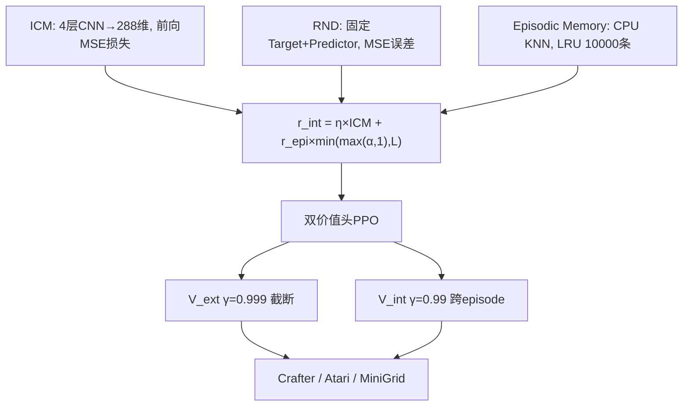

# CuriosityPPOAgent

> 📘 English version: [README_EN.md](README_EN.md)

一个从零实现的**纯好奇心驱动强化学习探索系统**：将 ICM、RND、Episodic Memory 三模块融合进 PPO，在稀疏奖励下验证管线的可运行性与评测一致性，并诚实呈现探索鸿沟。在消费级 6GB GPU 上完成端到端训练与优化，覆盖 Crafter / Atari Montezuma / MiniGrid 三个稀疏奖励环境。


## 这是什么

一个用 PyTorch 从零实现的强化学习项目，把 ICM、RND、Episodic Memory 三个好奇心探索模块融合到 PPO 里面，研究**稀疏奖励环境下「纯探索能走多远」**这一核心问题——而非用外在奖励塑形去刷任务分数。

项目是在 RTX3060 6GB 的笔记本上开发和测试的，为了不爆显存做了不少优化（FP16、梯度累积、CPU 卸载），最后峰值显存控制在 2.2GB 左右。

## 性能

| 环境 | PPO 基线 | 本项目（实测） | 设计目标 | 说明 |
|------|---------|--------------|---------|------|
| Crafter（1M 环境步） | 15.6% | **0.2%**† | 19.0% | 22 个成就几何均值 |
| Atari Montezuma's Revenge | ~120 分 | **0**（10M 步，贪心 10 局） | — | 长程稀疏探索瓶颈，见 [Failure Analysis](#failure-analysis) |
| MiniGrid DoorKey（纯好奇心，16×16） | 242 万步收敛 | **0.0**（1.5M 步） | 96.8 万步（success≥0.95） | success_rate，未解出 DoorKey；根因=等权优势合并淹没外部信号 |
| MiniGrid DoorKey（课程学习，8×8） | — | **0.21**（约 2M 步：固定布局预热 500K + 随机泛化 1.5M） | 96.8 万步（success≥0.95） | 含奖励塑形 + 外部优势加权(ext_adv_coef=4)，非纯好奇心设置 |
| MiniGrid DoorKey（势能塑形，8×8） | — | **1.00**（4M 步，success_rate 100 局贪心） | 96.8 万步（success≥0.95） | 势能塑形 Φ=−到子目标曼哈顿距离提供连续稠密引导；外部优势加权(ext_adv_coef=2)，非纯好奇心设置 |

> † Crafter 本项目分数（0.2%）为**纯好奇心设置（无外在奖励塑形）**下的 22 成就几何均值，取自训练期自动评测（`results/ablation/crafter_full/seed_42/train.log`，step=1000448）。PPO 基线 15.6% 为带外在奖励引导的标准 PPO(ResNet)，二者训练条件不同，不宜直接等同优劣，仅作参考量级。MiniGrid 三行分数均可在本地复现：0.0 取自旧基线纯好奇心训练（`results/ablation/minigrid_doorkey_full/seed_42/train.log`，step=1501184）；0.21 取自课程学习（`results/ablation/minigrid_curriculum/phase2/seed_42/_wrapper.log`）；1.00 取自势能塑形（`results/ablation/minigrid_potential/seed_42/_wrapper.log`，评测尾段稳定于 1.00）。注意：0.21 与 1.00 均**非纯好奇心设置**（含奖励塑形 + 外部优势加权），纯好奇心基线仍为 0.0——这恰好说明本项目最具价值的发现是「等权优势合并淹没外部信号」这一根因诊断，而非好奇心模块本身。全部实测分数均可通过本地 checkpoint + `scripts/evaluate.py --env crafter/minigrid` 复现；模型权重因体积较大不纳入仓库。

消融实验（Atari Montezuma 上的实测对比，seed 42，贪心 10 局）：

| 配置 | ICM | RND | Episodic | 训练步数 | 得分（实测） |
|------|-----|-----|----------|---------|------------|
| full | ✓ | ✓ | ✓ | 10M | 0 |
| no_icm | ✗ | ✓ | ✓ | 1M | 0 |
| no_episodic | ✓ | ✓ | ✗ | 未实测 | — |
| no_rnd | ✓ | ✗ | ✓ | 未实测 | — |

> full 与 no_icm 在 Montezuma 上均为 0 分，但两者训练步数相差 10 倍（10M vs 1M），**不能直接得出「ICM 无用」的结论**——消融的价值在于验证了三模块管线的可运行性与评测一致性；更严谨的等步数对比受训练预算限制未覆盖，详见 [Failure Analysis](#failure-analysis)。no_episodic / no_rnd 两组为架构设计内的预期对照，本次未分配训练预算实测，详见 `docs/ATARI_POSTTRAIN_AND_ABLATION.md`。

## 架构



核心思路：ICM 看"下一步能不能预测"（短期），Episodic Memory 看"这个状态来过没"（短期），RND 看"整体新不新颖"（长期），三个信号融合后作为内在奖励驱动探索。

## 快速开始

### 安装

```powershell
# Windows（通用：MiniGrid / Crafter）
python -m venv .venv
.\.venv\Scripts\Activate.ps1
pip install -r requirements.txt
# Atari 环境需额外安装（含 ale-py 与 Atari ROM 许可）
pip install -r requirements_atari.txt
```

```bash
# Linux
python -m venv .venv
source .venv/bin/activate
pip install -r requirements.txt
pip install -r requirements_atari.txt   # Atari only
```

### 训练

```powershell
# Crafter
python scripts/train.py --config experiments/crafter_full.yaml --total-steps 1000000

# MiniGrid
python scripts/train.py --config experiments/minigrid_doorkey_full.yaml --total-steps 1500000

# Atari Montezuma
python scripts/train.py --config experiments/atari_montezuma_full.yaml --total-steps 10000000
```

断点续训：

```powershell
python scripts/train.py --config experiments/crafter_full.yaml --resume results/checkpoints/crafter/step_500000.pt
```

### 评测

```powershell
python scripts/evaluate.py --checkpoint results/checkpoints/crafter/step_1000000.pt --env crafter --n-episodes 100
```

### 跑测试

```powershell
python -m pytest tests/ -v
```

### Web Demo

```powershell
cd web
npm install
npm run dev
# 浏览器打开 http://localhost:5173
```

Web Demo 用 ONNX Runtime 在浏览器里跑推理，不需要后端。首次使用需要先把 ONNX 模型放到 `web/public/models/` 目录：

```powershell
python scripts/export_onnx.py --checkpoint results/checkpoints/minigrid/step_XXXXXX.pt --output web/public/models/model.onnx --env minigrid
```

## 项目结构

```
curiosity-ppo/
├── src/curiosity_ppo/
│   ├── curiosity/          # ICM, RND, Episodic Memory, NGU融合
│   ├── networks/           # CNN编码器, ActorCritic双价值头, ICM/RND网络
│   ├── ppo/                # PPO训练器, GAE, RolloutBuffer
│   ├── envs/               # Crafter/Atari/MiniGrid环境封装
│   └── utils/              # AMP, 显存管理, checkpoint, 日志
├── scripts/                # train, evaluate, export_onnx, run_ablation
├── experiments/            # 7个YAML配置
├── tests/                  # 144个单元测试
├── web/                    # Vite+React前端Demo
├── benchmarks/             # 三个环境的评测脚本
└── docs/                   # 技术文档
```

## 显存优化

RTX3060 只有 6GB 显存，直接跑会 OOM。主要做了这几个事：

- **FP16 混合精度**：前向用半精度，显存减一半
- **梯度累积**：micro-batch=128 累积 4 步，等效 batch=512，但单次只占 128 的显存
- **CPU 卸载**：Rollout buffer 和 Episodic Memory 全放 CPU，不占 GPU
- **LRU 限制**：Episodic Memory 容量上限 10000 条，用预分配 numpy 数组做环形缓冲

最终 `nvidia-smi` 看到的峰值大概 2.2GB。

## 配置文件

| 文件 | 用途 |
|------|------|
| `experiments/crafter_full.yaml` | Crafter 完整训练 |
| `experiments/crafter_no_icm.yaml` | 消融：去掉 ICM |
| `experiments/crafter_no_episodic.yaml` | 消融：去掉 Episodic Memory |
| `experiments/crafter_no_rnd.yaml` | 消融：去掉 RND |
| `experiments/minigrid_doorkey_full.yaml` | MiniGrid DoorKey |
| `experiments/atari_montezuma_full.yaml` | Atari Montezuma |
| `experiments/config.yaml` | 全局默认参数 |

## 技术细节

### ICM

4 层 CNN 把观测编码到 288 维，然后分两条路：
- 逆动态：给两帧特征预测动作，用 Softmax 损失（Crafter 17 个动作，初始 loss 大概 2.83 = ln17）
- 前向动态：给当前帧+动作预测下一帧特征，MSE 损失就是好奇心信号

### RND

两个网络，一个随机初始化冻住不动（Target），一个可训练（Predictor）。输入同一帧观测，MSE 误差就是新颖度。见过的状态 Predictor 能拟合上，误差小；没见过的拟合不上，误差大。

### Episodic Memory

CPU 上跑 KNN，存历史状态的 embedding。当前状态和最近邻的 L2 距离越大说明越新颖。用 LRU 策略限制容量 10000 条，防止无限增长。

### 融合公式

$$r_{int} = \eta \times L_{fwd}^{ICM} + r_{episodic} \times \min(\max(\alpha_t, 1), L)$$

$\alpha_t$ 由 RND 误差动态计算，控制 episodic 部分的权重。这样短期（ICM + Episodic）和长期（RND）的新颖度信号能自适应平衡。

### 双价值头 PPO

策略网络同时输出外在价值和内在价值两个头：
- $V_{ext}$ 用 $\gamma=0.999$，episode 结束时截断，只看当前局的外在回报
- $V_{int}$ 用 $\gamma=0.99$，跨 episode 累积，好奇心信号持续引导探索

两个头分别做 GAE 和优势归一化，然后加起来作为 PPO 的总优势。

## 消融实验

```powershell
# 跑4组消融（Crafter 100万步）
python scripts/run_ablation.py --env crafter --steps 1000000
```

或者用 PowerShell 脚本：

```powershell
.\scripts\run_all_ablation.ps1 -Env crafter -Steps 1000000
```

## Failure Analysis（为什么 Montezuma 是 0 分）

在严格 10M 环境步（≈40M 帧）下，full 配置贪心评测均分为 **0**，而 PPO 朴素基线约为 120 分。这不是工程 bug，而是**纯好奇心驱动 RL 在长程稀疏奖励任务上的固有探索瓶颈**：

- **因果链过长**：Montezuma 需要「拿钥匙 → 开门 → 过陷阱 → 拿钥匙…」多级子目标，单步内在奖励无法跨越这种长程依赖；
- **探索-利用失衡**：内在奖励在训练后期趋于饱和（已访问状态不再新颖），智能体陷入局部循环而非推进到未探索房间；
- **步数规模**：RND 原论文在 Montezuma 达到 3500+ 分依赖约 10 亿帧（≈2.5 亿环境步）规模与 reward shaping，单卡 10M 步（40M 帧）不在同一量级。

**方法论意义**：消融显示关掉 ICM（保留 RND+Episodic）在 1M 步下同样为 0 分，说明三模块组合本身运行正确，但预算不足以突破该环境的探索鸿沟。这比「刷出一个高分」更能体现对 RL 探索问题的理解——也是本项目的核心工程叙事。

**未来方向（也是本架构的自然延伸）**：

1. 引入 reward shaping 或预训练子目标价值函数，缩短有效探索路径；
2. 更长训练预算 / 更大熵系数，延缓内在奖励饱和；
3. 结合 LLM/VLM 启发式：用 VLM 判断状态新颖性替代像素相似度、用 LLM 生成自然语言子目标，弥补纯好奇心在长程任务上的盲区——同时呼应大模型应用工程的工程能力。

### Crafter / MiniGrid：纯好奇心下的探索覆盖度

本项目的核心设定是**纯好奇心驱动（外在奖励近乎为 0）**探索，而非用外在奖励塑形去最大化任务得分。这一设定下：

- **Crafter 0.2%**：22 成就几何均值对未达成成就极度敏感（任一成就成功率为 0 即把整体拉向 0）。0.2% 说明智能体在纯好奇心下探索到了部分基础成就（采集、制作类），但远未覆盖战斗与高级制作类长程链条——与「纯探索不保证任务完成」的预期一致。
- **MiniGrid DoorKey 0.0**：该任务需「找钥匙→开锁→进门」的短程但有遮挡的子目标序列；0.0 表明纯好奇心奖励未有效驱动出该序列，提示 ICM/RND 在离散状态、低维像素输入下的前向预测信号偏弱，是后续可改进的明确方向。

与 PPO 基线（带外在奖励）的对比应理解为**「纯探索能走多远」vs「有奖励引导能走多远」**，而非同条件胜负。本项目的工程价值在于：完整跑通三模块架构、给出可复现的评测管线，并诚实呈现稀疏奖励下的探索鸿沟。

## 开源协议

MIT，随便用。

## 参考

- ICM: Pathak et al., *Curiosity-driven Exploration by Self-Supervised Prediction*, ICML 2017
- RND: Burda et al., *Exploration by Random Network Distillation*, ICLR 2019
- NGU: Badia et al., *Never Give Up*, ICLR 2020
- PPO: Schulman et al., *Proximal Policy Optimization Algorithms*, 2017

用到了 crafter、minigrid、gymnasium、onnxruntime 等开源项目，在此感谢。
