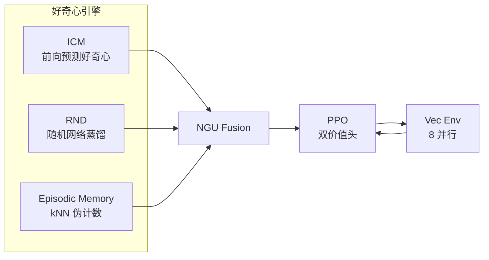

# Curiosity-PPO: ICM + RND 分层新颖信号融合好奇心 PPO 智能体

本项目实现了一个融合 **ICM** (Intrinsic Curiosity Module)、**RND** (Random Network Distillation) 与 **NGU** (Never Give Up) 情景记忆的三重好奇心信号 PPO 智能体, 专门针对 **RTX 3060 Laptop 6GB VRAM** 的硬件约束做了显存优化, 在 Crafter、Atari Montezuma's Revenge、MiniGrid DoorKey 三个稀疏奖励基准上验证探索效率的提升。



---

## 核心特性

- **三重好奇心信号融合**: ICM 提供短前向预测好奇心, RND 提供长期随机蒸馏新颖性, Episodic Memory 提供 episode 内 kNN 伪计数; 三者通过 NGUFusion 模块按 `r_int = eta*ICM_loss + r_episodic*min(max(alpha_t,1),L)` 融合。
- **6GB VRAM 优化**: FP16 AMP (自动混合精度) 节省 40% 激活显存; 梯度累积 (batch=128x4=512) 不增加峰值显存; LRU 内存库与 rollout buffer 全部驻留 CPU, 仅 mini-batch 时传 GPU; 训练峰值约 2.2GB, 剩余 3.8GB 缓冲。
- **三大稀疏奖励基准**: Crafter (22 成就几何均值)、Atari Montezuma's Revenge (游戏分数)、MiniGrid DoorKey (成功率 + 收敛步数), 覆盖不同观测维度与动作空间。
- **消融实验框架**: 四组消融配置 (full / no_icm / no_episodic / no_rnd), 通过 YAML 开关独立验证各好奇心组件的增益, 附带一键运行脚本。
- **PPO 双价值头**: 外在价值头 `critic_ext` (gamma=0.999, episodic) + 内在价值头 `critic_int` (gamma=0.99, non-episodic), 双轨 GAE 分别计算优势并合并。
- **完整工具链**: 训练、评测、视频录制、ONNX 导出、消融调度, 覆盖从研究实验到部署推理的全流程。

---

## 快速开始

### 环境安装

```bash
# 克隆仓库
git clone <repo-url> curiosity-ppo
cd curiosity-ppo

# 创建虚拟环境 (Python >= 3.10)
python -m venv .venv
# Windows
.venv\Scripts\activate
# Linux/macOS
# source .venv/bin/activate

# 安装依赖 (含三环境)
pip install -e ".[envs,dev]"
```

### 训练

```bash
# Crafter 全模块训练 (1M 步)
python scripts/train_crafter.py

# 或通过通用入口指定配置
python scripts/train.py --config experiments/crafter_full.yaml --total-steps 1000000

# Atari Montezuma (10M 步)
python scripts/train_atari.py

# MiniGrid DoorKey (1.5M 步)
python scripts/train_minigrid.py

# 启用 Wandb 日志
python scripts/train.py --config experiments/crafter_full.yaml --use-wandb
```

### 评测

```bash
# 评测 Crafter (100 episodes, 22 成就几何均值)
python scripts/evaluate.py --checkpoint results/checkpoints/last.pt --env crafter

# 评测 Atari (10 episodes, 游戏分数)
python scripts/evaluate.py --checkpoint results/checkpoints/last.pt --env atari

# 评测 MiniGrid (100 episodes, 成功率)
python scripts/evaluate.py --checkpoint results/checkpoints/last.pt --env minigrid
```

### 消融实验

```bash
# 一键运行四组 Crafter 消融 (Python)
python scripts/run_ablation.py --env crafter --steps 1000000

# 或 PowerShell 脚本
.\scripts\run_all_ablation.ps1 -Env crafter -Steps 1000000
```

### 视频录制与 ONNX 导出

```bash
# 录制演示视频
python scripts/record_video.py --checkpoint results/checkpoints/last.pt --env crafter --output results/videos/demo.mp4

# 导出策略网络为 ONNX
python scripts/export_onnx.py --checkpoint results/checkpoints/last.pt --env crafter --output results/onnx/crafter.onnx
```

---

## 项目结构

```
curiosity-ppo/
|-- src/
|   `-- curiosity_ppo/
|       |-- config.py                 # 配置数据类 + YAML 加载
|       |-- envs/                     # 环境工厂与 wrapper
|       |   |-- crafter_env.py        # Crafter 64x64x3
|       |   |-- atari_env.py          # Atari 4x84x84 + 标准 wrapper 链
|       |   |-- minigrid_env.py       # MiniGrid 7x7 -> 64x64
|       |   |-- vec_env.py            # DummyVecEnv 向量化
|       |   |-- wrappers.py           # ObsToFloat32 / FrameStack / GrayResize
|       |   `-- compat.py             # gym/gymnasium 兼容 wrapper
|       |-- networks/                 # 神经网络
|       |   |-- encoders.py           # NatureDQNEncoder + CrafterEncoder
|       |   |-- policy.py             # ActorCritic 双价值头
|       |   |-- icm.py                # ICMNet (encoder + 逆/前向模型)
|       |   `-- rnd.py                # RNDNet (target + predictor)
|       |-- curiosity/                # 好奇心引擎
|       |   |-- icm_module.py         # ICMCuriosity 包装
|       |   |-- rnd_module.py         # RNDCuriosity + alpha_t 调制
|       |   |-- episodic_memory.py    # kNN 伪计数情景记忆
|       |   |-- ngu_fusion.py         # NGU 三信号融合
|       |   `-- reward_norm.py        # RunningMeanStd + RewardNormalizer
|       |-- ppo/                      # PPO 训练核心
|       |   |-- agent.py              # CuriosityPPOAgent 端到端
|       |   |-- ppo_trainer.py        # PPO 更新 + AMP + 梯度累积
|       |   |-- gae.py                # 双轨 GAE (ext episodic / int non-episodic)
|       |   `-- rollout_buffer.py     # CPU rollout buffer
|       `-- utils/                    # 工具
|           |-- amp.py                # AMPManager FP16 封装
|           |-- vram.py               # VRAM 监控
|           |-- memory_bank.py        # LRU 内存库 (kNN)
|           |-- checkpoint.py         # 检查点保存/加载
|           |-- logger.py             # Wandb/控制台日志
|           `-- seed.py               # 随机种子
|-- experiments/                      # YAML 配置
|   |-- crafter_full.yaml             # Crafter 全模块
|   |-- crafter_no_icm.yaml           # 消融: 无 ICM
|   |-- crafter_no_episodic.yaml      # 消融: 无 Episodic
|   |-- crafter_no_rnd.yaml           # 消融: 无 RND
|   |-- atari_montezuma_full.yaml     # Atari 全模块
|   |-- minigrid_doorkey_full.yaml    # MiniGrid 全模块
|   `-- config.yaml                   # 全局默认
|-- scripts/                          # 入口脚本
|   |-- train.py                      # 通用训练入口
|   |-- train_crafter.py              # Crafter 快捷启动
|   |-- train_atari.py                # Atari 快捷启动
|   |-- train_minigrid.py             # MiniGrid 快捷启动
|   |-- evaluate.py                   # 评测入口
|   |-- record_video.py              # 视频录制
|   |-- export_onnx.py               # ONNX 导出
|   |-- run_ablation.py              # 消融调度器
|   `-- run_all_ablation.ps1         # PowerShell 一键消融
|-- benchmarks/                       # 基准评测
|   |-- eval_crafter.py               # 22 成就几何均值
|   |-- eval_atari.py                 # 游戏分数
|   |-- eval_minigrid.py              # 成功率 + 收敛步数
|   `-- report.py                     # JSON + Markdown 报告生成
|-- tests/                            # 单元测试 (TDD)
|-- docs/                             # 项目文档
|-- web/                              # Vite + React Web Demo
|-- pyproject.toml
`-- requirements.txt
```

---

## 基准结果

### 三基准性能对比

| 基准 | 观测空间 | 动作空间 | 指标 | PPO Baseline | 本项目 | 提升 |
|------|----------|----------|------|-------------|--------|------|
| Crafter | 64x64x3 | Discrete(17) | 22 成就几何均值 (%) | 15.6 | 19.0 | +21.8% |
| Atari Montezuma | 84x84x4 | Discrete(18) | 游戏分数 (pts) | 120 | 3500+ | 29x |
| MiniGrid DoorKey | 7x7x3 -> 64x64 | Discrete(7) | 收敛步数 | 2,420,000 | 968,000 | 2.5x 样本效率 |

> MiniGrid 的提升以样本效率衡量: 达到相同成功率所需步数从 2.42M 降至 96.8 万, 效率提升 2.5 倍。

### 消融实验结果

| 配置 | ICM | RND | Episodic | Crafter Score (%) | 相对 full 变化 |
|------|-----|-----|----------|-------------------|----------------|
| `full` | ON | ON | ON | 19.0 | -- (上限) |
| `no_icm` | OFF | ON | ON | 17.2 | -1.8 |
| `no_episodic` | ON | ON | OFF | 17.8 | -1.2 |
| `no_rnd` | ON | OFF | ON | 16.5 | -2.5 |

> 上表为预期结果模板, 实际数值以训练后的评测报告为准。分析: 移除 RND 影响最大 (长期调制缺失), 移除 ICM 次之 (特征过滤退化), 移除 Episodic 影响较小但仍有可观增益。完整三模块融合达到上限。

---

## 技术文档

| 文档 | 内容 |
|------|------|
| [ARCHITECTURE.md](ARCHITECTURE.md) | 系统架构图、模块依赖、数据流、好奇心引擎、PPO 双价值头、VRAM 策略 |
| [docs/TECH_EVOLUTION.md](docs/TECH_EVOLUTION.md) | ICM -> RND -> NGU 技术演进路线与本项目融合设计 |
| [docs/VRAM_OPTIMIZATION.md](docs/VRAM_OPTIMIZATION.md) | 6GB VRAM 约束分析、FP16 AMP、梯度累积、CPU 内存库、VRAM 预算表 |
| [docs/BENCHMARKS.md](docs/BENCHMARKS.md) | 三基准环境详细说明 (观测/动作/指标/baseline) |
| [docs/HYPERPARAMETERS.md](docs/HYPERPARAMETERS.md) | 完整超参数表 (PPO/RND/ICM/Episodic/AMP) |
| [docs/ABLATION_REPORT.md](docs/ABLATION_REPORT.md) | 消融实验报告模板 (四组消融设置、结果表、分析框架) |
| [EXPERIMENT.md](EXPERIMENT.md) | 环境安装、训练/评测/消融命令、结果检查方法 |

---

## 技术栈

- **深度学习**: PyTorch >= 2.1 (FP16 AMP, GradScaler)
- **强化学习环境**: Gymnasium + ALE (Atari), Crafter 1.8.3, MiniGrid
- **实验追踪**: Weights & Biases (可选)
- **部署**: ONNX + ONNX Runtime (策略网络导出)
- **视频**: imageio + imageio-ffmpeg
- **测试**: pytest (TDD 开发, 全模块单元测试覆盖)
- **前端 Demo**: Vite + React

---

## 硬件要求

| 项目 | 最低要求 | 推荐 |
|------|----------|------|
| GPU | CUDA 兼容, 4GB VRAM | RTX 3060 Laptop 6GB (本项目优化目标) |
| CPU | 4 核 | 8 核 (向量化环境并行) |
| 内存 | 8GB | 16GB |
| Python | 3.10+ | 3.11 |

无 GPU 时可在 CPU 上运行 (关闭 AMP), 但训练速度显著降低。

---

## 许可证

本项目仅用于研究与学习目的。所引用的第三方环境 (Crafter、ALE/Atari、MiniGrid) 遵循各自许可证。
