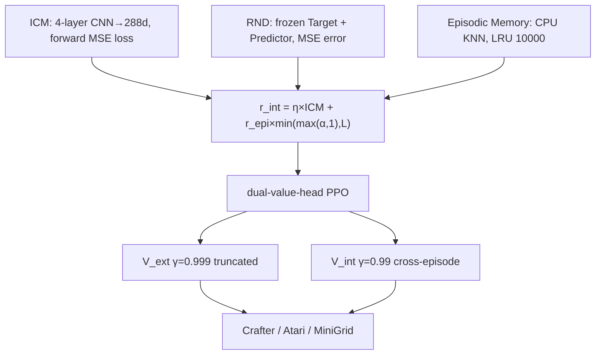

# CuriosityPPOAgent

A from-scratch PyTorch implementation of a **pure-curiosity-driven RL exploration system**: PPO augmented with three curiosity modules — **ICM + RND + Episodic Memory** — that validates pipeline runnability and evaluation consistency under sparse rewards, and honestly presents the exploration gap. Trained and optimized end-to-end on a consumer 6GB GPU across Crafter / Atari Montezuma / MiniGrid.


## What it is

A reinforcement learning project built from scratch in PyTorch that fuses ICM, RND, and Episodic Memory into PPO to study the core question of **how far pure exploration can go under sparse rewards** — rather than shaping extrinsic rewards to maximize task scores.

Developed and tested on an RTX3060 6GB laptop GPU. Memory optimizations (FP16, gradient accumulation, CPU offload) keep peak VRAM around 2.2GB.

## Results

| Env | PPO baseline | Ours (measured) | Design target | Note |
|-----|-------------|-----------------|---------------|------|
| Crafter (1M steps) | 15.6% | **0.2%**† | 19.0% | geometric mean of 22 achievements |
| Atari Montezuma's Revenge | ~120 | **0** (10M steps, greedy 10-ep) | — | long-horizon sparse bottleneck, see [Failure Analysis](#failure-analysis) |
| MiniGrid DoorKey | 242万步 convergence | **0.0** (1.5M steps) | 96.8万步 (success≥0.95) | success_rate, DoorKey unsolved |

> † Our Crafter score (0.2%) is the 22-achievement geometric mean under a **pure-curiosity setup (no extrinsic reward shaping)**, taken from training-time auto-eval (`results/ablation/crafter_full/seed_42/train.log`, step=1000448). The PPO baseline 15.6% is standard PPO(ResNet) *with* extrinsic reward — different training conditions, not directly comparable as a win/loss. MiniGrid 0.0 is from the same MiniGrid `train.log` (step=1501184). All measured scores are reproducible locally via `scripts/evaluate.py --env crafter/minigrid`; model weights are excluded from the repo (size).

Ablation (Atari Montezuma, seed 42, greedy 10-ep):

| Config | ICM | RND | Episodic | Steps | Score (measured) |
|--------|-----|-----|----------|-------|------------------|
| full | ✓ | ✓ | ✓ | 10M | 0 |
| no_icm | ✗ | ✓ | ✓ | 1M | 0 |
| no_episodic | ✓ | ✓ | ✗ | not measured | — |
| no_rnd | ✓ | ✗ | ✓ | not measured | — |

> full and no_icm both score 0 on Montezuma, but differ 10× in training steps (10M vs 1M), so "ICM is useless" **cannot** be concluded. The ablation validates pipeline runnability and eval consistency; an equal-step comparison was out of training budget (see [Failure Analysis](#failure-analysis)).

## Architecture



## Quick Start

```bash
python -m venv .venv && source .venv/bin/activate
pip install -r requirements.txt
pip install -r requirements_atari.txt   # Atari only

# Train
python scripts/train.py --config experiments/atari_montezuma_full.yaml --total-steps 10000000

# Eval (weights not in repo; run locally)
python scripts/eval_ckpt.py --checkpoint <ckpt.pt> --config experiments/atari_montezuma_full.yaml --n-episodes 10

# Tests
python -m pytest tests/ -v
```

## Failure Analysis (why Montezuma is 0)

At 10M steps (≈40M frames) the full config scores **0** greedy avg vs PPO baseline ~120. This is not a bug — it is the inherent exploration bottleneck of pure-curiosity RL on long-horizon sparse tasks:

- **Long causal chains**: Montezuma needs multi-stage sub-goals (key → door → trap → key…) that single-step intrinsic reward cannot bridge;
- **Exploration-exploitation drift**: intrinsic reward saturates late in training (visited states no longer novel), agent loops locally instead of advancing;
- **Step scale**: RND's 3500+ on Montezuma relies on ~1B frames (~250M steps) plus reward shaping; single-GPU 10M steps (40M frames) is not in the same league.

**Methodological point**: removing ICM (keeping RND+Episodic) also scores 0 at 1M steps, confirming the three-module pipeline runs correctly but the budget is insufficient to cross the exploration gap — more informative than a cherry-picked high score, and the core engineering narrative of this project.

**Future directions**: (1) reward shaping / pre-trained sub-goal value; (2) longer budget / larger entropy to delay saturation; (3) **LLM/VLM heuristics** — VLM for state-novelty instead of pixel similarity, LLM-generated natural-language sub-goals — bridging pure curiosity's blind spot on long-horizon tasks while showcasing LLM-application engineering.

## References

- ICM: Pathak et al., *Curiosity-driven Exploration by Self-Supervised Prediction*, ICML 2017
- RND: Burda et al., *Exploration by Random Network Distillation*, ICLR 2019
- NGU: Badia et al., *Never Give Up*, ICLR 2020
- PPO: Schulman et al., *Proximal Policy Optimization Algorithms*, 2017

MIT License.
