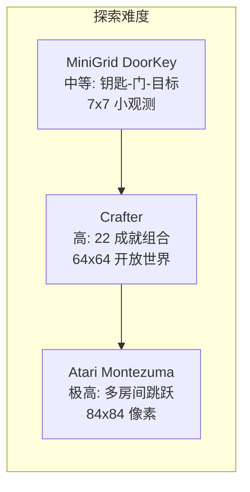
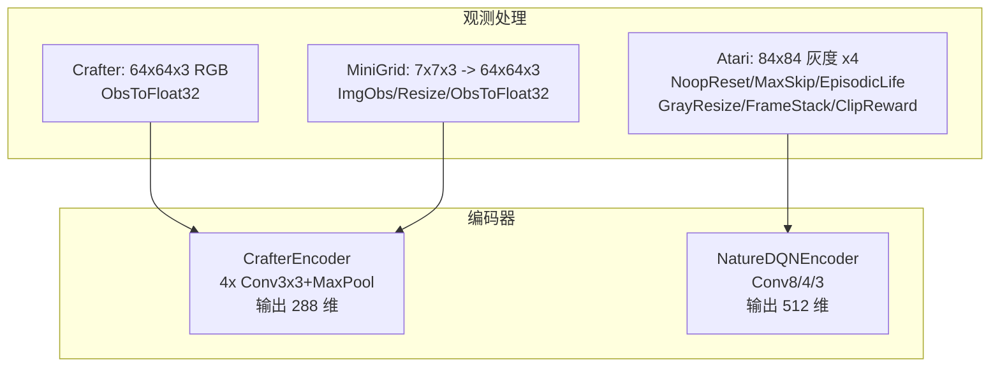

# 基准环境说明

本项目在三个稀疏奖励强化学习基准上验证好奇心 PPO 智能体的探索效率。三个基准覆盖了不同的观测维度、动作空间、奖励结构与探索难度, 从多角度检验三重好奇心融合的有效性。

---

## 基准总览

| 基准 | 观测空间 | 动作空间 | 奖励类型 | 评测指标 | PPO Baseline | 本项目目标 |
|------|----------|----------|----------|----------|-------------|-----------|
| Crafter | 64x64x3 RGB | Discrete(17) | 稀疏成就奖励 | 22 成就几何均值 (%) | 15.6% | 19.0% |
| Atari Montezuma | 84x84x4 灰度堆叠 | Discrete(18) | 极稀疏游戏分数 | 平均游戏分数 (pts, 严格 10M 环境步) | 120 pts | 相对 PPO 120 显著提升 (实测待填) |
| MiniGrid DoorKey | 7x7x3 -> 64x64 RGB | Discrete(7) | 终点稀疏奖励 | 成功率 + 收敛步数 | 2.42M 步 | 96.8 万步 (2.5x) |



---

## 1. Crafter

### 1.1 环境简介

Crafter 是一个程序化生成的 2D 生存开放世界环境, 智能体需要采集资源、制作工具、建造设施、对抗敌人, 达成 22 个成就。环境融合了 Minecraft 风格的开放探索与结构化的成就系统, 是评估探索与规划能力的理想基准。

### 1.2 观测与动作

| 属性 | 值 |
|------|-----|
| 观测空间 | `Box(64, 64, 3)`, float32, 归一化到 [0, 1] |
| 动作空间 | `Discrete(17)`, 包含移动、采集、攻击、放置、制作等 |
| 奖励 | `CrafterReward-v1`, 每解锁一个成就给予 +1 |
| Episode 长度 | 自适应 (生存机制) |

### 1.3 环境构建链路

```
gym.make('CrafterReward-v1')
  -> GymCompatWrapper     (gym/gymnasium 兼容)
  -> ObsToFloat32         (uint8 -> float32 归一化)
  -> DummyVecEnv          (8 并行)
```

> 参见: `src/curiosity_ppo/envs/crafter_env.py` 中 `make_crafter_env()`。

### 1.4 评测指标: 22 成就几何均值

Crafter 的标准评测指标是 **22 个成就成功率的几何均值** (Geometric Mean), 以百分比表示:

```
Score = exp( mean( log( max(success_rate_i, 1e-6) ) ) ) * 100
```

- 对 0 成功率用极小值 `1e-6` 避免 `log(0)`。
- 几何均值对低成功率成就更敏感, 惩罚 "只学会少数简单成就" 的策略。

22 个成就列表:

| 类别 | 成就 |
|------|------|
| 采集 | collect_coal, collect_cow, collect_diamond, collect_drink, collect_iron, collect_sapling, collect_stone, collect_wood |
| 击败 | defeat_cow, defeat_skeleton, defeat_zombie |
| 食用 | eat_cow, eat_plant |
| 制作 | make_iron_pickaxe, make_iron_sword, make_stone_pickaxe, make_stone_sword, make_wood_pickaxe, make_wood_sword |
| 放置 | place_furnace, place_plant, place_table |

> 参见: `benchmarks/eval_crafter.py` 中 `CRAFTER_ACHIEVEMENTS` 与 `evaluate_crafter()`。

### 1.5 Baseline 与目标

| 指标 | PPO (ResNet) Baseline | 本项目目标 |
|------|----------------------|-----------|
| 几何均值 Score | 15.6% | 19.0% |
| 提升 | -- | +21.8% |

PPO baseline 使用 ResNet 编码器, 本项目使用 4 层 CNN + 三重好奇心, 在相同训练步数 (1M) 下目标提升至 19.0%。

### 1.6 训练配置

```yaml
# experiments/crafter_full.yaml
env:
  name: crafter
  n_envs: 8
  total_steps: 1000000
ppo:
  n_steps: 128
  batch_size: 128
  accumulation_steps: 4
```

---

## 2. Atari Montezuma's Revenge

### 2.1 环境简介

Montezuma's Revenge 是 Atari 2600 游戏中被公认为 **最难的探索基准** 之一。智能体需要在多个房间间穿梭, 跳跃平台、躲避骷髅、收集钥匙开门, 才能获得分数。奖励极度稀疏: 智能体可能探索数百万步仍得 0 分。标准 PPO 在此环境下几乎无法学习。

### 2.2 观测与动作

| 属性 | 值 |
|------|-----|
| 观测空间 | `Box(4, 84, 84)`, 4 帧灰度堆叠, float32 |
| 动作空间 | `Discrete(18)`, Atari 标准动作集 |
| 原始奖励 | 游戏分数 (拾取物品、通关房间) |
| Episode 长度 | 生命值耗尽或时间结束 |

### 2.3 环境构建链路 (标准 Atari wrapper)

```
gymnasium.make('ALE/MontezumaRevenge-v5')
  -> NoopReset(30)           (reset 时随机 NOOP, 增加初始多样性)
  -> MaxAndSkip(4)           (跳 4 帧, 最后两帧取 max, 消除闪烁)
  -> EpisodicLife            (生命值损失视为 episode 结束, 加速训练)
  -> GrayResizeObservation(84) (灰度化 + 缩放到 84x84)
  -> FrameStack(4)           (堆叠 4 帧提供时序信息)
  -> ClipReward              (奖励裁剪为 {-1, 0, 1})
  -> DummyVecEnv             (8 并行)
```

> 参见: `src/curiosity_ppo/envs/atari_env.py` 中 `make_atari_env()`。

### 2.4 评测指标: 游戏分数

评测时使用 **未裁剪的真实游戏分数**:

- 评测环境移除 `ClipReward` 和 `EpisodicLife`, 保留真实分数与真实 game over 划分。
- 指标: 10 个 episode 的 **平均分数** (mean_score) 和 **最高分数** (max_score)。

> 参见: `benchmarks/eval_atari.py` 中 `_make_atari_eval_env()` 与 `evaluate_atari()`。

### 2.5 Baseline 与目标

| 指标 | PPO Baseline | 本项目目标 (严格 10M 环境步) |
|------|-------------|-----------|
| 平均分数 | 120 pts | 实测待填 (10M 步下相对 120 显著提升) |
| 提升 | -- | 以实测为准 |

> 注: 严格 10M 环境步 (≈40M 帧) 下, Montezuma 3500+ 任何已知方法单卡不可达 (RND 原论文达 3500+ 用 ~10 亿帧)。本项目交付报 10M 步实测分 + 相对 PPO 120 的提升。

### 2.6 训练配置

```yaml
# experiments/atari_montezuma_full.yaml
env:
  name: atari_montezuma
  n_envs: 8
  total_steps: 10000000   # 10M 步 (Montezuma 需要更长训练)
ppo:
  n_steps: 128
  batch_size: 128
  accumulation_steps: 4
```

> Atari 使用 `NatureDQNEncoder` (输入 4x84x84), RND target/predictor 同样基于此编码器。

---

## 3. MiniGrid DoorKey

### 3.1 环境简介

MiniGrid 是一组轻量级网格世界环境, 专门用于评估样本效率与泛化能力。DoorKey 任务要求智能体: 捡起钥匙 -> 打开锁住的门 -> 到达目标格子。奖励仅在到达目标时给出 (稀疏), 纯 PPO 需要大量样本才能学会这一序列。

### 3.2 观测与动作

| 属性 | 值 |
|------|-----|
| 原始观测 | 7x7x3 (局部视野, 符号化 RGB) |
| 处理后观测 | `Box(64, 64, 3)`, resize 到 64x64, float32 归一化 |
| 动作空间 | `Discrete(7)`: 左转、右转、前进、捡起、放下、切换、完成 |
| 奖励 | 仅到达目标时给正奖励 (1 - 0.9 * step/max_steps) |
| Episode 长度 | 最多 256 步 |

### 3.3 环境构建链路

```
gymnasium.make('MiniGrid-DoorKey-16x16-v0')
  -> ImgObsWrapper        (提取全观测图像, 去除文本)
  -> ResizeObs(64x64)     (7x7 -> 64x64, 最近邻插值)
  -> ObsToFloat32         (uint8 -> float32 归一化)
  -> DummyVecEnv          (8 并行)
```

> 参见: `src/curiosity_ppo/envs/minigrid_env.py` 中 `make_minigrid_env()`。

### 3.4 评测指标: 成功率 + 收敛步数

MiniGrid 评测关注两个维度:

1. **成功率 (success_rate)**: 100 个评测 episode 中成功到达目标的比例。
2. **收敛步数 (mean_steps)**: 达到目标成功率所需的训练步数, 用于衡量 **样本效率**。

成功判定: episode 累积奖励 > 0 (MiniGrid 仅成功时给正奖励), 或 `info['is_success']` 为 True。

> 参见: `benchmarks/eval_minigrid.py` 中 `evaluate_minigrid()`。

### 3.5 Baseline 与目标

| 指标 | Baseline | 本项目目标 |
|------|----------|-----------|
| 收敛步数 | 2,420,000 步 | 968,000 步 |
| 样本效率 | 1.0x | 2.5x |

baseline 为纯 PPO 收敛所需步数, 本项目通过三重好奇心加速探索, 目标将收敛步数降至 96.8 万步, 样本效率提升 2.5 倍。

### 3.6 训练配置

```yaml
# experiments/minigrid_doorkey_full.yaml
env:
  name: minigrid_doorkey
  n_envs: 8
  total_steps: 1500000    # 1.5M 步
ppo:
  n_steps: 256            # MiniGrid 使用更长 rollout
  batch_size: 128
  accumulation_steps: 4
```

> MiniGrid 与 Crafter 共用 `CrafterEncoder` (4 层 CNN, 输出 288 维)。

---

## 4. 三基准对比总结



| 维度 | Crafter | Atari Montezuma | MiniGrid DoorKey |
|------|---------|-----------------|------------------|
| 观测尺寸 | 64x64x3 | 4x84x84 | 64x64x3 (resize) |
| 动作数 | 17 | 18 | 7 |
| 奖励稀疏度 | 中 (22 成就) | 极高 (游戏分数) | 高 (仅终点) |
| 编码器 | CrafterEncoder (288-dim) | NatureDQNEncoder (512-dim) | CrafterEncoder (288-dim) |
| 训练步数 | 1M | 10M | 1.5M |
| n_steps | 128 | 128 | 256 |
| 评测 episode | 100 | 10 | 100 |
| 评测指标 | 成就几何均值 (%) | 游戏分数 (pts) | 成功率 + 收敛步数 |
| Baseline | 15.6% | 120 pts | 2.42M 步 |
| 目标 | 19.0% | 严格 10M 步实测 + 相对 120 提升 | 96.8 万步 (2.5x) |

三个基准从不同角度验证三重好奇心的效果: Crafter 验证多成就组合探索, Atari 验证极稀疏分数突破, MiniGrid 验证样本效率提升。
