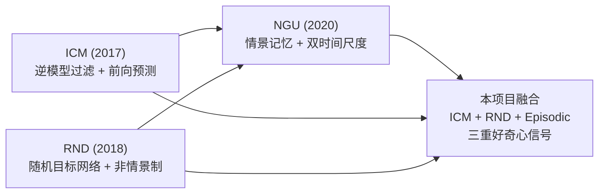

# ICM -> RND -> NGU 技术演进

本文档梳理内在动机 (intrinsic motivation) 驱动的强化学习探索方法的技术演进路线: 从 ICM 的前向预测好奇心, 到 RND 的随机网络蒸馏, 再到 NGU 的情景记忆 + 双时间尺度融合, 最后说明本项目如何将三者融合为统一的三重好奇心信号。



---

## 1. 问题背景: 稀疏奖励探索难题

在强化学习中, 基于 extrinsic reward (外在奖励) 的策略优化方法 (如 PPO、DQN) 在密集奖励场景下表现优异。但当奖励信号极其稀疏时, 智能体难以获得有效梯度, 探索效率急剧下降。这一问题在以下场景中尤为突出:

- **Atari Montezuma's Revenge**: 智能体必须穿越多个房间、跳跃平台、躲避陷阱才能获得第一个奖励。标准 PPO 在该环境下得分接近 0 分, 被称为 " hardest exploration game "。
- **MiniGrid DoorKey**: 智能体需要先捡起钥匙、再开门、最后到达目标, 奖励仅在到达终点时给出。纯 PPO 需要约 2.42M 步才能收敛, 探索效率低下。
- **Crafter**: 22 个成就的稀疏组合奖励, 需要长期规划与层次化探索策略。

核心挑战: **如何在没有外在奖励引导时, 驱动智能体主动探索未见过的状态?**

内在奖励 (intrinsic reward) 的核心思想是: 为智能体构造一个自驱动的探索信号 `r_int`, 当智能体遇到 "新颖" (novel) 的状态时给予高内在奖励, 鼓励其持续探索。关键技术问题在于如何定义和度量 "新颖性"。

---

## 2. ICM (Pathak 2017): 逆模型过滤噪声 + 前向预测好奇心

**论文**: Pathak et al., "Curiosity-driven Exploration by Self-Supervised Prediction", ICML 2017.

### 2.1 核心思想

ICM (Intrinsic Curiosity Module) 用一个自监督的前向预测模型来衡量状态的新颖性: 如果模型无法准确预测下一个状态的特征, 说明该状态是新颖的, 给予高好奇心奖励。

### 2.2 逆动力学编码器: 过滤 noisy TV

直接在原始像素空间做前向预测存在严重问题: 像素中包含大量与动作无关的噪声 (如 " noisy TV " 电视雪花、随机背景纹理), 前向模型会浪费容量去预测这些不可预测的噪声, 导致好奇心信号被噪声淹没。

ICM 的关键创新是引入 **逆动力学模型 (inverse dynamics model)**:

- 给定相邻两帧的观测 `s_t` 和 `s_{t+1}`, 逆模型预测智能体采取了什么动作 `a_t`。
- 逆模型的训练目标迫使 encoder `phi` 只编码 **与动作相关的特征** (即那些能推断出动作的特征), 主动丢弃无法由动作解释的噪声维度。

```
逆模型:  a_pred = g_inv(phi(s_t), phi(s_{t+1}))
损失:    L_inverse = CrossEntropy(a_pred, a_t)
```

这样, encoder `phi` 学到的特征空间天然过滤了 noisy TV 等不可控噪声, 使前向预测的好奇心信号更加纯净。

### 2.3 前向模型: 预测误差作为好奇心

在过滤后的特征空间 `phi` 中, 前向模型根据当前特征和动作预测下一特征:

```
前向模型:  phi_pred = f_fwd(phi(s_t), a_t)
好奇心:    r_int = eta * || f_fwd(phi(s_t), a) - phi(s_{t+1}) ||^2
```

其中 `eta` 为内在奖励缩放系数。前向预测误差越大, 说明状态越新颖, 好奇心越高。

### 2.4 训练目标

ICM 的总损失为逆模型损失与前向模型损失之和:

```
L_ICM = L_inverse + L_forward
       = CrossEntropy(g_inv(phi_t, phi_next), a) + MSE(f_fwd(phi_t, a), phi_next.detach())
```

注意: 前向损失中 `phi_next` 被 detach, 误差只通过 `phi_t` 反传, 防止 encoder 为了降低前向损失而坍塌特征。

### 2.5 本项目中的 ICM 实现

- **Encoder**: `CrafterEncoder`, 4 层 CNN (Conv3x3 + ReLU + MaxPool) 输出 288 维特征 (`feature_dim=288`)。
- **逆模型**: `Linear(288*2, 256) -> ReLU -> Linear(256, action_dim)`, 输出动作 logits。
- **前向模型**: `Linear(288 + action_dim, 256) -> ReLU -> Linear(256, 288)`, 预测下一特征。
- **内在奖励**: `r_icm = eta * forward_loss`, 默认 `eta=0.2`。
- **复用**: encoder 输出的 `phi_t` 作为情景记忆的 controllable embedding (可控性嵌入)。

> 参见: `src/curiosity_ppo/networks/icm.py` (`ICMNet`) 与 `src/curiosity_ppo/curiosity/icm_module.py` (`ICMCuriosity`)。

### 2.6 ICM 的局限

- 前向预测好奇心是 **短时程** 的: 一旦前向模型学会预测某状态, 好奇心迅速衰减为 0, 智能体可能停止探索。
- 缺乏 **跨 episode 的长期探索记忆**: 每次 episode 重置后, 前向模型 "忘记" 之前见过的状态, 可能反复回到已知区域。

---

## 3. RND (Burda 2018): 随机目标网络 + 非情景内在回报

**论文**: Burda et al., "Exploration by Random Network Distillation", ICLR 2019.

### 3.1 核心思想

RND (Random Network Distillation) 用一个 **固定随机初始化的 target 网络** 作为 "新颖性锚点", 训练一个 predictor 网络去逼近 target 的输出。预测误差越大, 说明该观测越新颖。

### 3.2 双网络结构

- **Target 网络**: 固定随机初始化, 参数 `requires_grad=False`, 始终处于 eval 模式, 永不更新。
- **Predictor 网络**: encoder + 多层 FC, 学习逼近 target 的输出。

```
target_out  = target(obs)          # 固定, 不带梯度
pred_out    = predictor(obs)       # 可训练
内在奖励:    r_int = ((pred_out - target_out)^2).mean(dim=-1)
```

RND 的精妙之处在于: target 网络定义了一个 **固定的随机投影**, predictor 需要在所有见过的观测上拟合这个投影。对于未见过的观测, predictor 尚未学会拟合, 误差自然较大。随着训练进行, predictor 逐渐覆盖已见区域, 误差下降, 好奇心衰减。

### 3.3 关键创新: 非情景制 (non-episodic)

RND 的另一个关键设计是内在回报的 **非情景制** 处理:

- 外在价值使用 `gamma_ext` 并在 episode 结束时截断 (情景制, episodic)。
- 内在价值使用 `gamma_int=0.99` 且 **不在 episode 边界截断** (非情景制, non-episodic), 即 `dones` 全部视为 0, 内在回报跨 episode 累积。

这一设计确保: 即使外在奖励稀疏, 内在价值函数也能持续学习, 驱动智能体追求长期新颖性而非短期回报。

### 3.4 观测归一化至关重要

RND 对观测归一化极其敏感。原始像素尺度差异会导致 target 网络输出方差过大, 使预测误差被少数高方差维度主导。本项目使用 `RunningMeanStd` (Welford 在线算法) 对观测进行流式归一化:

```
obs_normalized = (obs - running_mean) / (running_std + 1e-8)
```

此外, RND 内在奖励本身也需要归一化 (除以 running std), 否则训练初期误差极大、训练后期误差趋近 0 的尺度变化会破坏 PPO 的优势估计。

### 3.5 本项目中的 RND 实现

- **Target**: `NatureDQNEncoder` (Atari) 或 `CrafterEncoder` (Crafter/MiniGrid), 输出 512 维, 参数冻结。
- **Predictor**: 同型 encoder + 3 层 FC (512 -> 512 -> 512 -> 512)。
- **观测归一化**: `RunningMeanStd`, 在线更新。
- **奖励归一化**: RND error 除以 running std, 防止尺度漂移。
- **alpha_t 长期调制**: 归一化后的 RND error 经 sigmoid 映射到 `[1, L]` 区间, 作为 NGU 的长期调制系数。

> 参见: `src/curiosity_ppo/networks/rnd.py` (`RNDNet`) 与 `src/curiosity_ppo/curiosity/rnd_module.py` (`RNDCuriosity`)。

### 3.6 RND 的优势与局限

- **优势**: 实现简单, 不需要逆模型; 非情景制提供稳定的长期探索驱动; 对 noisy TV 有一定鲁棒性 (随机投影的低维结构天然忽略高频噪声)。
- **局限**: 缺乏 **短期情景记忆**: RND 的 predictor 是全局训练的, 不会在 episode 内快速响应 "刚去过的地方", 可能导致 episode 内的重复探索。

---

## 4. NGU (Badia 2020): 情景记忆 + RND 双时间尺度融合

**论文**: Badia et al., "Agent57: Outperforming the Atari Human Benchmark", ICML 2020. (NGU 为 Agent57 的探索组件, 首见于 "Never Give Up: Learning Directed Exploration Strategies", ICLR 2020.)

### 4.1 核心思想

NGU (Never Give Up) 同时利用 **短期情景记忆** 和 **长期 novelty 调制**, 构造一个双时间尺度的内在奖励:

```
r_t^i = r_t^episodic * min{ max{alpha_t, 1}, L }    (L = 5)
```

- `r_t^episodic`: 短期 novelty, 基于 episode 内的 kNN 伪计数, **每 episode 清空**。
- `alpha_t`: 长期 novelty 调制系数, 基于 RND 误差, **跨 episode 持久**。

### 4.2 Episodic 内在奖励: kNN 伪计数

NGU 维护一个 episode 内的记忆库, 存储已访问状态的 controllable embedding。对于当前状态:

1. 在记忆库中做 kNN 搜索, 得到 k 个最近邻距离 `d_1, ..., d_k`。
2. 计算 **伪计数** (pseudo-count):

```
d_m^2 = mean(d_i^2)                              # k 近邻距离平方均值
N(x) = sum_i kernel( d_i^2 / (d_m^2 + epsilon) ) # kernel 平滑伪计数
```

其中 kernel 函数 `kernel(x) = epsilon / (x + epsilon)`, 距离越近贡献越大。

3. 情景内在奖励:

```
r_episodic = 1 / sqrt( N(x) + 1e-8 )
```

- 空库 (N=0) 时返回极大值, 表示极度新颖。
- 状态越常被访问, N(x) 越大, 奖励越小, 抑制重复。
- **每 episode 结束时清空记忆库**, 实现 "短期" 探索: 鼓励在本 episode 内探索新区域, 但允许跨 episode 重新探索。

### 4.3 alpha_t: 长期 RND 调制

`alpha_t` 由 RND 误差驱动, 提供 **跨 episode 的长期 novelty 调制**:

```
normalized_error = RND_error / (running_std + 1e-8)
alpha_t = 1 + (L - 1) * sigmoid(normalized_error)    # 映射到 [1, L]
```

- 当 RND 误差大 (长期新颖区域) 时, `alpha_t` 趋近 `L`, 放大情景奖励。
- 当 RND 误差小 (长期已知区域) 时, `alpha_t` 趋近 1, 压制情景奖励。
- `min{ max{alpha_t, 1}, L }` 确保调制系数被裁剪到 `[1, L]` 区间。

### 4.4 Controllable Embedding

NGU 的情景记忆使用的 embedding 来自 **ICM 逆模型的 encoder**。这一选择继承了 ICM 的可控性过滤: embedding 只编码与动作相关的特征, 避免 noisy TV 等不可控噪声污染 kNN 距离计算。

### 4.5 双时间尺度的协同

```mermaid
graph TB
    subgraph 短期 "短期 (episodic, 每 episode 清空)"
        E1["Controllable Embedding"] --> E2["kNN 伪计数 N(x)"]
        E2 --> E3["r_episodic = 1/sqrt(N+eps)"]
    end
    subgraph 长期 "长期 (non-episodic, 跨 episode 持久)"
        R1["RND 误差"] --> R2["归一化 + sigmoid"]
        R2 --> R3["alpha_t in [1, L]"]
    end
    E3 --> F["r_ngu = r_episodic * min(max(alpha,1),L)"]
    R3 --> F
```

- **短期记忆** 防止 episode 内的重复探索: 刚去过的地方 N(x) 大, 奖励低。
- **长期调制** 防止跨 episode 的重复探索: 长期已知的区域 alpha_t 趋近 1, 即使 episode 记忆清空, 也不会重新获得高奖励。
- 两者乘积形成 **"永不放弃"** 的持续探索驱动: 既不会因短期满足而停止, 也不会因长期遗忘而重复。

### 4.6 NGU 的局限

- 实现复杂度高: 需要 kNN 搜索、伪计数 kernel、记忆库管理。
- kNN 搜索的计算开销随记忆库规模增长 (本项目用 LRU 限制容量为 10000)。
- 单独使用时缺乏 ICM 的前向预测信号, 可控性过滤依赖外部 embedding。

---

## 5. 本项目融合设计: 三重好奇心信号

本项目将 ICM、RND、Episodic Memory 三者融合为统一的好奇心引擎, 由 `NGUFusion` 模块协调。

### 5.1 融合公式

```
r_int = r_icm + r_ngu
```

其中:

- **r_icm** (短前向预测好奇心, 仅当 `config.icm.enabled`):

```
r_icm = eta * || f_fwd(phi(s_t), a) - phi(s_{t+1}) ||^2
```

- **r_ngu** (NGU 情景 + 长期融合):

```
r_ngu = r_episodic * min{ max{alpha_t, 1}, L }    (当 episodic 启用)
r_ngu = r_rnd                                       (仅 RND, 无 episodic 时)
r_ngu = 0                                           (均禁用时)
```

### 5.2 三重信号的分工

| 信号 | 时间尺度 | 来源 | 作用 |
|------|----------|------|------|
| r_icm | 短 (前向预测) | ICM forward model | 驱动 agent 学习状态转移, 对未预测的状态转移给予即时好奇心 |
| r_episodic | 中 (episode 内) | kNN 伪计数, 每 episode 清空 | 防止 episode 内重复访问, 鼓励单局探索新区域 |
| alpha_t (RND) | 长 (跨 episode) | RND 误差, sigmoid 映射 | 调制情景奖励, 长期已知区域降低探索驱动 |

### 5.3 融合架构

```mermaid
graph TB
    subgraph 输入 "观测与动作"
        S["s_t, a, s_{t+1}"]
    end

    subgraph ICM "ICM 模块"
        I1["Encoder phi"] --> I2["逆模型 (过滤噪声)"]
        I1 --> I3["前向模型 (预测 phi_next)"]
        I3 --> I4["r_icm = eta * forward_loss"]
        I1 --> I5["phi_t (controllable embedding)"]
    end

    subgraph RND "RND 模块"
        R1["Target (固定)"] --> R3["MSE 误差"]
        R2["Predictor (可训练)"] --> R3
        R3 --> R4["归一化"]
        R4 --> R5["r_rnd (内在奖励)"]
        R4 --> R6["alpha_t = 1+(L-1)*sigmoid(...)"]
    end

    subgraph Episodic "Episodic Memory"
        E1["kNN 伪计数 N(x)"] --> E2["r_episodic = 1/sqrt(N+eps)"]
        E1 -.->|"每 episode 清空"| E3["reset"]
    end

    S --> I1
    S --> R1
    S --> R2
    I5 --> E1

    I4 --> OUT["r_int = r_icm + r_ngu"]
    E2 --> NGU["r_ngu = r_episodic * min(max(alpha,1),L)"]
    R6 --> NGU
    R5 --> NGU
    NGU --> OUT
```

### 5.4 实现细节

- **ICM 的 embedding 复用**: ICM encoder 输出的 `phi_t` 既用于前向预测, 又作为情景记忆的 controllable embedding, 避免维护独立编码器。当 ICM 禁用时, 回退使用 RND target 输出作为 embedding。
- **RND 的双重角色**: RND 既提供独立的内在奖励 (no_episodic 配置), 又为 NGU 提供 `alpha_t` 长期调制系数。
- **Episodic 的 LRU 容量限制**: 记忆库容量 10000, 超出时 FIFO 淘汰最旧嵌入, 控制 kNN 搜索开销。
- **消融可控性**: 通过 `config.icm.enabled`、`config.rnd.enabled`、`config.episodic.enabled` 三个开关, 可独立验证每个组件的增益。

### 5.5 消融验证各组件独立增益

本项目设计四组消融实验来验证三重好奇心各组件的独立贡献:

| 配置 | ICM | RND | Episodic | 验证目标 |
|------|-----|-----|----------|----------|
| `full` | ON | ON | ON | 完整三重好奇心 (上限) |
| `no_icm` | OFF | ON | ON | ICM 特征过滤的增益 |
| `no_episodic` | ON | ON | OFF | 短期情景记忆的增益 |
| `no_rnd` | ON | OFF | ON | 长期 RND 调制的增益 |

详见 `docs/ABLATION_REPORT.md`。

---

## 参考文献

1. Pathak, D., Agrawal, P., Efros, A. A., & Darrell, T. (2017). Curiosity-driven Exploration by Self-Supervised Prediction. ICML.
2. Burda, Y., Edwards, H., Storkey, A., & Klimov, O. (2019). Exploration by Random Network Distillation. ICLR.
3. Badia, A. P., Sprechmann, P., Vitvitskyi, A., et al. (2020). Agent57: Outperforming the Atari Human Benchmark. ICML.
4. Badia, A. P., Piot, B., Kapturowski, S., et al. (2020). Never Give Up: Learning Directed Exploration Strategies. ICLR.
5. Schulman, J., Wolski, F., Dhariwal, P., Radford, A., & Klimov, O. (2017). Proximal Policy Optimization Algorithms. arXiv.
6. Houthooft, R., Chen, X., Duan, Y., Schulman, J., De Turck, F., & Abbeel, P. (2016). VIME: Variational Information Maximizing Exploration. NeurIPS.
7. Bellemare, M. G., Srinivasan, S., Ostrovski, G., et al. (2016). Unifying Count-Based Exploration and Intrinsic Motivation. NeurIPS.
