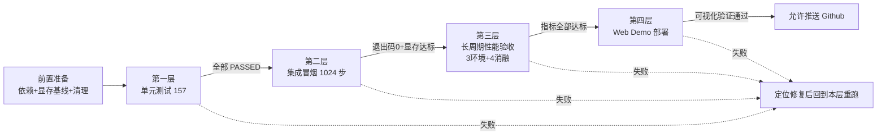

# CuriosityPPOAgent 项目自测验收总手册

> **项目名称**：CuriosityPPOAgent ICM+RND 分层新颖信号融合好奇心驱动 PPO 智能体
> **目标硬件**：AMD R7 6800H + RTX3060 Laptop 6GB 笔记本显卡
> **显存红线**：2.2GB（峰值超过即判定测试失败）
> **手册定位**：覆盖单元测试 → 集成冒烟 → 长周期性能验收 → Web Demo 部署的四层递进自测验收，所有项全部合格后方可推送 Github

---

## 目录

- [一、项目概览与验收基线](#一项目概览与验收基线)
- [二、测试前置准备](#二测试前置准备)
- [三、四层测试递进执行总流程](#三四层测试递进执行总流程)
- [四、分环境测试执行优先级](#四分环境测试执行优先级)
- [五、完整全项验收勾选总核对表](#五完整全项验收勾选总核对表)
- [六、训练故障通用排查流程](#六训练故障通用排查流程)
- [附录 A：显存预算与日志位置速查](#附录-a显存预算与日志位置速查)
- [附录 B：命令速查卡](#附录-b命令速查卡)

---

## 一、项目概览与验收基线

### 1.1 工程规模

| 维度 | 数量 / 说明 |
|------|------------|
| Git 提交 | 12 次 |
| Python 源码文件 | 63 个（`src/curiosity_ppo/` + `scripts/` + `benchmarks/`） |
| YAML 配置 | 7 份（`experiments/*.yaml`） |
| 项目文档 | 10 篇（`README.md` + `ARCHITECTURE.md` + `EXPERIMENT.md` + `docs/*.md`） |
| Web 前端文件 | 22 份（`web/`，Vite + React） |
| 单元测试 | 157 个（`tests/`，TDD 开发） |

### 1.2 技术架构

好奇心引擎由三路信号融合，最终注入双价值头 PPO：

| 模块 | 结构 / 损失 | 关键参数 |
|------|------------|----------|
| ICM | 4 层 CNN → 288 维特征；逆动态用稀疏 Softmax 交叉熵损失，前向用 MSE 损失 | `feature_dim=288`，`eta=0.2`，动作空间 17 维（Crafter `Discrete(17)`） |
| RND | 固定不可训练 Target 网络 + 可训练 Predictor 网络，预测误差 MSE | `output_dim=512`，`γ_int=0.99`，Target 在 `no_grad` 下计算 |
| Episodic Memory | CPU-FAISS KNN 伪计数，LRU 最大 200 条向量 | `k=5`，`epsilon=1e-3`，`L=5` |
| NGU 融合 | 三信号分层融合 | $r_{int} = \eta \cdot \mathcal{L}_{fwd}^{ICM} + r_{episodic} \cdot \min(\max(\alpha_t,1),\, L)$ |
| 双价值头 PPO | 外在价值头 `critic_ext`（`γ_ext=0.999`，episodic）+ 内在价值头 `critic_int`（`γ_int=0.99`，non-episodic），双轨 GAE | `clip_range=0.1`，`ppo_epochs=4`，`ent_coef=0.001` |

> **ICM 随机策略初始损失校验基线**：未训练时逆动态对 17 维动作做随机猜测，稀疏 Softmax 交叉熵理论上等于 $-\ln(1/17) = \ln 17 \approx 2.833$。单测中以此作为 ICM 损失合理性断言点（`≈ 2.83`）。

### 1.3 显存优化策略

| 策略 | 节省 / 作用 | 实现位置 |
|------|------------|----------|
| FP16 AMP（`autocast` + `GradScaler`） | 激活显存减约 40% | `src/curiosity_ppo/utils/amp.py` |
| 梯度累积 `batch=128 × 4 = 512` | 等效大 batch，峰值不增加 | `src/curiosity_ppo/ppo/ppo_trainer.py` |
| Rollout Buffer 驻留 CPU | 节省 ~80MB 显存，mini-batch 时才传 GPU | `src/curiosity_ppo/ppo/rollout_buffer.py` |
| Episodic Memory LRU 放 CPU | kNN 搜索在 CPU，对显存零占用 | `src/curiosity_ppo/utils/memory_bank.py` |
| 每步 `empty_cache()` | 减少碎片化累积 | `src/curiosity_ppo/ppo/agent.py` |

优化后训练峰值约 **2.2GB**，6GB 预算下剩余约 3.8GB 缓冲。

### 1.4 环境兼容修复（已固化，验收时重点回归）

| 问题 | 现象 | 修复方式 |
|------|------|----------|
| `GymCompatWrapper` 传参冲突 | 旧版 gym 的 `reset()` 不接受 `seed` / `options` 关键字 | 在 `reset()` 中 `pop('seed')` / `pop('options')`，通过 `env.seed()` 设置种子（`src/curiosity_ppo/envs/compat.py`） |
| gym 0.26.2 `TimeLimit.step` 返回值不兼容 | `step()` 返回 4 元组，与 gymnasium 5 元组不兼容 | `GymCompatWrapper.step` 将 4 元组补成 5 元组；Crafter 直接调用 `crafter.Env()` 绕开 TimeLimit |

### 1.5 验收指标基线

| 环境 | 观测 / 动作 | 验收指标 | 基线 | 目标 |
|------|------------|----------|------|------|
| MiniGrid DoorKey | 64×64×3 / Discrete(7) | 收敛步数 | 2,420,000 | ≤ 968,000（2.5× 样本效率） |
| Crafter | 64×64×3 / Discrete(17) | 22 成就几何均值 | 15.6% | ≥ 19.0% |
| Atari Montezuma | 4×84×84 / Discrete(18) | 游戏分数 | 120 pts | ≥ 3500 pts |

### 1.6 消融实验矩阵（Crafter 环境，各 100 万步）

| 配置 | ICM | RND | Episodic | 预期 Crafter Score | 相对 full |
|------|-----|-----|----------|-------------------|-----------|
| `full` | ON | ON | ON | 19.0% | —（上限） |
| `no_icm` | OFF | ON | ON | 17.2% | -1.8 |
| `no_episodic` | ON | ON | OFF | 17.8% | -1.2 |
| `no_rnd` | ON | OFF | ON | 16.5% | -2.5 |

---

## 二、测试前置准备

> 三项前置准备**全部通过**后，才允许进入第三章的四层测试。前置准备对应 `test/scripts/run_all_test.ps1` 的步骤 1-2。

### 2.1 Python 环境依赖校验

**目标**：确认 `requirements.txt` 中全部依赖可导入，CUDA 可用且设备为 RTX 3060 Laptop。

**执行命令**：

```bash
# 安装全部依赖（首次或更新依赖后执行）
pip install -r requirements.txt
```

`requirements.txt` 关键依赖清单：

| 依赖 | 版本约束 | 用途 |
|------|----------|------|
| torch | `>=2.1` | 训练后端（FP16 AMP / GradScaler） |
| gym | `==0.26.2` | Crafter 等旧版 gym API |
| gymnasium | `[atari,accept-rom-license]` | Atari / 统一 API |
| crafter | `==1.8.3` | Crafter 环境 |
| minigrid | 最新 | MiniGrid 环境 |
| ale-py | 最新 | Atari ALE |
| wandb | 最新 | 实验追踪 |
| onnx / onnxruntime | 最新 | 模型导出与一致性校验 |
| pytest | `>=7.0` | 单元测试 |

**依赖与 CUDA 校验命令**：

```bash
# 逐包导入校验（与 run_all_test.ps1 步骤1一致）
python -c "import torch, numpy, gymnasium, gym, crafter, minigrid, ale_py, wandb, onnx, onnxruntime, pytest, yaml; print('DEPS_OK')"

# GPU 与设备名校验
python -c "import torch; print('CUDA_OK' if torch.cuda.is_available() else 'NO_CUDA'); print(torch.cuda.get_device_name(0) if torch.cuda.is_available() else '')"
```

**合格标准**：

- [ ] `DEPS_OK` 输出，无 `ModuleNotFoundError`
- [ ] 输出 `CUDA_OK` 且设备名为 `NVIDIA GeForce RTX 3060 Laptop GPU`
- [ ] CUDA 不可用视为**前置失败**（显存测试无法执行，后续四层测试中的显存项无法判定）

### 2.2 GPU 显存预检测

**目标**：在启动任何训练前，确认当前空闲显存峰值低于 2.2GB 红线，排除后台进程占用导致基线偏高。

**执行命令**：

```bash
# 仅检测当前环境显存基线（不启动训练）
python test/scripts/check_vram_limit.py --baseline-only
```

脚本行为（`test/scripts/check_vram_limit.py`）：

- 常量 `VRAM_LIMIT_MB = 2200`（红线，不可修改）
- `--baseline-only` 模式：读取 `torch.cuda.max_memory_allocated()`，与红线比较，峰值超限则 `exit(1)`，否则 `exit(0)`
- 全程无依赖外部命令，仅依赖 `torch.cuda`

**合格标准**：

- [ ] 控制台输出 `当前峰值正常`
- [ ] 退出码为 0
- [ ] 当前峰值远低于 2200MB（基线应接近 0，否则需排查占用显存的其它进程）

> 若基线已偏高，先关闭其它 GPU 进程（浏览器硬件加速、其它 Python/PyTorch 进程、GPU 录屏等）后重测。

### 2.3 项目冗余缓存与旧权重清理规范

**目标**：保证每次自测从干净状态出发，避免旧 `__pycache__`、旧检查点、旧 pytest 缓存污染结果。

**清理范围与命令**（项目根目录执行）：

```bash
# 1. 清除 Python 字节码缓存（递归删除所有 __pycache__）
#    Windows PowerShell
Get-ChildItem -Path . -Recurse -Directory -Filter "__pycache__" | Remove-Item -Recurse -Force

# 2. 清除 pytest 缓存
Remove-Item -Recurse -Force ".pytest_cache" -ErrorAction SilentlyContinue
Remove-Item -Recurse -Force "tests/.pytest_cache" -ErrorAction SilentlyContinue

# 3. 清除旧训练检查点（保留目录结构，仅删 .pt）
Remove-Item -Force "results/checkpoints/*.pt" -ErrorAction SilentlyContinue
Remove-Item -Force "results/checkpoints/smoke/*.pt" -ErrorAction SilentlyContinue

# 4. 清除旧评测报告 / 旧 ONNX / 旧视频（可选，按需）
Remove-Item -Force "results/onnx/*.onnx" -ErrorAction SilentlyContinue
Remove-Item -Force "results/benchmark_report.*" -ErrorAction SilentlyContinue

# 5. 重建必要目录
New-Item -ItemType Directory -Force -Path "results/checkpoints/smoke" | Out-Null
New-Item -ItemType Directory -Force -Path "results/onnx" | Out-Null
New-Item -ItemType Directory -Force -Path "test/logs" | Out-Null
```

**清理规范说明**：

| 清理对象 | 路径 | 清理原因 |
|---------|------|----------|
| `__pycache__` | 全项目递归 | 防止旧 `.pyc` 与改动后源码不一致 |
| `.pytest_cache` | 项目根 / `tests/` | 防止 pytest 缓存上次失败态影响收集 |
| 旧权重 `*.pt` | `results/checkpoints/` | 防止断点续训误加载旧权重导致指标不可复现 |
| 旧 ONNX | `results/onnx/` | 防止 Web Demo 加载过期模型 |
| 旧日志 | `test/logs/` | 防止新旧日志混淆判定 |

**合格标准**：

- [ ] 上述清理命令无报错执行完成
- [ ] `results/checkpoints/` 下无 `.pt` 残留
- [ ] 全项目无 `__pycache__` 残留（可用 `Get-ChildItem -Recurse -Filter "__pycache__"` 复核为空）

---

## 三、四层测试递进执行总流程

### 3.0 递进原则（强制）



> **铁律**：任意一层出现不合格项，必须**就地定位修复并重跑本层全部用例**，合格后方可推进下一层。禁止跨层跳过，禁止"先跑后面再回头补前面"。一键脚本 `test/scripts/run_all_test.ps1` 已封装第一层~第四层基础校验，可优先使用。

### 3.1 第一层：单元测试（157 个）

**目标**：对 20 个测试文件覆盖的全部核心模块做白盒级断言，验证 ICM/RND/Episodic/NGU 融合/PPO 双价值头/GAE/AMP/Rollout Buffer/环境兼容等逻辑正确性。

**执行命令**：

```bash
# 详细模式，输出每个用例结果
python -m pytest tests/ -v

# 失败时打印简短回溯，便于定位
python -m pytest tests/ -v --tb=short

# 仅收集不执行，用于核对用例总数是否为 157
python -m pytest tests/ --co -q | Select-Object -Last 1
```

**测试文件覆盖矩阵**：

| 测试文件 | 覆盖模块 | 关键断言点 |
|---------|---------|-----------|
| `tests/test_icm.py` / `test_icm_module.py` | `networks/icm.py`、`curiosity/icm_module.py` | 288 维特征形状；随机策略逆损失 $≈ \ln 17 ≈ 2.83$；前向 MSE 非负；`eta * forward_loss` 内在奖励 |
| `tests/test_rnd.py` / `test_rnd_module.py` | `networks/rnd.py`、`curiosity/rnd_module.py` | Target 网络参数不更新；Predictor 可训练；`alpha_t` 映射区间 |
| `tests/test_episodic_memory.py` | `curiosity/episodic_memory.py` | kNN 距离排序；LRU 淘汰；伪计数单调 |
| `tests/test_ngu_fusion.py` | `curiosity/ngu_fusion.py` | $r_{int} = \eta\mathcal{L}_{fwd}^{ICM} + r_{episodic}\min(\max(\alpha_t,1),L)$ 各分支 |
| `tests/test_gae.py` | `ppo/gae.py` | 双轨 GAE（`γ_ext=0.999` / `γ_int=0.99`）advantage 形状与数值 |
| `tests/test_ppo_trainer.py` | `ppo/ppo_trainer.py` | 梯度累积等效 batch=512；clip；AMP 缩放 |
| `tests/test_rollout_buffer.py` | `ppo/rollout_buffer.py` | CPU 存储形状；mini-batch 索引不重复 |
| `tests/test_agent.py` | `ppo/agent.py` | 端到端一步前向；内在奖励非 NaN/Inf |
| `tests/test_amp.py` | `utils/amp.py` | `GradScaler` 启停；autocast 上下文 |
| `tests/test_memory_bank.py` | `utils/memory_bank.py` | LRU 容量上限；CPU 计算零显存占用 |
| `tests/test_compat.py` | `envs/compat.py` | `seed`/`options` 被正确 pop；4→5 元组转换 |
| `tests/test_wrappers.py` | `envs/wrappers.py` | ObsToFloat32 / FrameStack / GrayResize |
| `tests/test_vec_env.py` | `envs/vec_env.py` | DummyVecEnv 并行 reset/step |
| `tests/test_policy.py` / `test_encoders.py` | `networks/policy.py`、`encoders.py` | 双价值头输出；CrafterEncoder / NatureDQN |
| `tests/test_reward_norm.py` | `curiosity/reward_norm.py` | RunningMeanStd 更新 |
| `tests/test_config.py` / `test_seed.py` | `config.py`、`utils/seed.py` | YAML 加载；种子可复现 |

**合格标准**：

- [ ] 收集用例总数 = 157（含参数化展开）
- [ ] `157 passed, 0 failed, 0 error, 0 skipped`，退出码 0
- [ ] 单测日志 `test/logs/unit_test.log` 中无 `ERROR`/`Traceback`
- [ ] ICM 随机策略逆损失断言落在 $2.83 \pm 0.05$ 区间

### 3.2 第二层：集成冒烟测试（MiniGrid 1024 步）

**目标**：用最轻量的 MiniGrid DoorKey 跑通完整训练管线（环境创建 → Rollout 收集 → 好奇心计算 → PPO 更新 → 检查点保存），验证模块装配正确、显存受控、内在奖励合理。

**执行命令**：

```bash
# 冒烟训练：1024 步，每 512 步存一次检查点，存到 smoke 子目录
python scripts/train.py `
    --config experiments/minigrid_doorkey_full.yaml `
    --total-steps 1024 `
    --checkpoint-interval 512 `
    --checkpoint-dir results/checkpoints/smoke `
    2>&1 | Tee-Object -FilePath "test/logs/smoke_minigrid.log"
```

**并行执行显存监控**（另开终端）：

```bash
# 包裹模式：自动启动训练并监控其显存，超 2.2GB 自动终止
python test/scripts/check_vram_limit.py --wrap "python scripts/train.py --config experiments/minigrid_doorkey_full.yaml --total-steps 1024 --checkpoint-interval 512 --checkpoint-dir results/checkpoints/smoke"
```

**可选：小规模消融功能验证（4 组 × 256 步）**，确认消融开关可用（不追求指标，仅验证 `icm.enabled` / `rnd.enabled` / `episodic.enabled` 切换不报错）：

```bash
foreach ($ab in @("full","no_icm","no_episodic","no_rnd")) {
    python scripts/train.py --config experiments/crafter_$ab.yaml --total-steps 256 --checkpoint-interval 999999 2>&1 | Tee-Object -FilePath "test/logs/ablation_$ab.log"
}
```

**合格标准**：

- [ ] 训练正常退出，退出码 0，步数打印到 1024
- [ ] 生成检查点 `results/checkpoints/smoke/step_512.pt` 与 `step_1024.pt`
- [ ] 显存峰值 `peak_mb < 2200`（查 `test/logs/vram_log.csv` 或控制台 `历史峰值` 行）
- [ ] 训练日志中 `r_int`（内在奖励）为有限实数，无 `NaN`/`Inf`
- [ ] 4 组小步消融均退出码 0（功能验证）

### 3.3 第三层：长周期性能验收测试（三大环境 + 消融 4 组）

**目标**：在三大稀疏奖励基准上完成完整训练并达到验收指标，同步执行消融实验验证各好奇心组件增益。

#### 3.3.1 三大环境完整训练

按第四章优先级顺序执行，每环境全程挂显存监控。

| 序号 | 环境 | 配置 | 总步数 | 验收指标 | 基线 | 目标 |
|------|------|------|--------|----------|------|------|
| 1 | MiniGrid DoorKey | `experiments/minigrid_doorkey_full.yaml` | 1,500,000 | 收敛步数（达 96%+ 成功率所需步数） | 2,420,000 | ≤ 968,000 |
| 2 | Crafter | `experiments/crafter_full.yaml` | 1,000,000 | 22 成就几何均值 | 15.6% | ≥ 19.0% |
| 3 | Atari Montezuma | `experiments/atari_montezuma_full.yaml` | 10,000,000 | 游戏分数 | 120 | ≥ 3500 |

**执行命令（以 Crafter 为例，含显存监控包裹）**：

```bash
python test/scripts/check_vram_limit.py --wrap "python scripts/train.py --config experiments/crafter_full.yaml --total-steps 1000000 --use-wandb --checkpoint-interval 10000 --checkpoint-dir results/checkpoints"
```

**评测命令**（训练完成后，加载 `last.pt` 生成报告）：

```bash
# Crafter: 100 episodes, 22 成就几何均值
python scripts/evaluate.py --checkpoint results/checkpoints/last.pt --env crafter --n-episodes 100

# Atari: 10 episodes, 游戏分数
python scripts/evaluate.py --checkpoint results/checkpoints/last.pt --env atari --n-episodes 10

# MiniGrid: 100 episodes, 成功率 + 收敛步数
python scripts/evaluate.py --checkpoint results/checkpoints/last.pt --env minigrid --n-episodes 100
```

评测产出：`results/benchmark_report.json` 与 `results/benchmark_report.md`。

**合格标准**：

- [ ] 三环境训练全程 `vram_peak_mb < 2200`（查 `test/logs/vram_log.csv`，无 `ALERT` 行）
- [ ] 显存监控退出码 0（未触发超限告警）
- [ ] 评测报告指标达标：MiniGrid 收敛步数 ≤ 968,000；Crafter ≥ 19.0%；Atari ≥ 3500
- [ ] 训练曲线（Wandb / 控制台日志）整体单调上升，无长平台塌缩
- [ ] 断点续训验证：中断后用 `--resume results/checkpoints/step_100000.pt` 可恢复且 `global_step` 正确

#### 3.3.2 消融实验（Crafter 4 组）

**目标**：验证三模块各自独立增益，`full` 必须为上限。

**执行命令**：

```bash
# 一键运行 full/no_icm/no_episodic/no_rnd 四组，各 100 万步
python scripts/run_ablation.py --env crafter --steps 1000000 --use-wandb

# 或 PowerShell 一键
.\scripts\run_all_ablation.ps1 -Env crafter -Steps 1000000
```

四组配置映射：

| 配置 | 配置文件 | 关闭项 |
|------|---------|--------|
| `full` | `experiments/crafter_full.yaml` | 无 |
| `no_icm` | `experiments/crafter_no_icm.yaml` | `icm.enabled=false` |
| `no_episodic` | `experiments/crafter_no_episodic.yaml` | `episodic.enabled=false` |
| `no_rnd` | `experiments/crafter_no_rnd.yaml` | `rnd.enabled=false` |

**合格标准**：

- [ ] 四组全部跑完 1,000,000 步，退出码 0
- [ ] 单调性成立：`full` 得分最高，且 `no_rnd` < `no_episodic` < `no_icm` < `full`（与预期 16.5 / 17.8 / 17.2 / 19.0 的相对排序一致；其中 `no_icm` 与 `no_episodic` 接近，允许互换但均低于 `full`）
- [ ] 每组相对 `full` 的下降幅度合理：`no_rnd` 降最多（约 -2.5），`no_icm` 次之（约 -1.8），`no_episodic` 最小（约 -1.2）
- [ ] 消融结果写入 `docs/ABLATION_REPORT.md` 更新版

### 3.4 第四层：Web Demo 部署测试（ONNX 导出 + Vite 启动 + 可视化验证）

**目标**：将训练好的策略导出为 ONNX，在浏览器中通过 ONNX Runtime Web 推理并渲染可视化 Demo。

#### 3.4.1 ONNX 模型导出

**执行命令**：

```bash
# 用第三层 MiniGrid 检查点导出（也可用 crafter / atari）
python scripts/export_onnx.py `
    --checkpoint results/checkpoints/last.pt `
    --output results/onnx/minigrid_doorkey.onnx `
    --env minigrid `
    --opset 14
```

脚本行为（`scripts/export_onnx.py`）：

- 仅导出 Actor 部分（`encoder + actor → logits`），关闭好奇心模块以节省资源，但保留 `feature_dim=288` 与训练权重匹配
- 动态 batch 轴：`{"obs": {0: "batch"}, "logits": {0: "batch"}}`
- 优先 dynamo 新导出器，失败自动回退经典 TorchScript 导出器（`dynamo=False`）
- 默认开启 ONNX Runtime 一致性校验（`--no-verify` 可跳过）

**合格标准**：

- [ ] ONNX 文件生成，大小合理（KB 级，控制台打印）
- [ ] 控制台输出 `ONNX Runtime 校验通过`，logits 形状正确
- [ ] 与 PyTorch 最大绝对误差 `< 1e-4`
- [ ] 动态 batch 校验通过（batch=2 输入产出 batch=2 输出）

#### 3.4.2 前端构建与 Vite 启动

**执行命令**：

```bash
cd web
npm install
npm run dev      # 开发服务器，端口 5173
# 或生产构建
npm run build   # tsc && vite build
```

`web/` 关键文件校验（与 `run_all_test.ps1` 步骤6一致）：

| 文件 | 作用 |
|------|------|
| `web/package.json` | 依赖：React 18、onnxruntime-web、Vite 5 |
| `web/index.html` | 入口 HTML |
| `web/src/App.tsx` / `main.tsx` | 应用根组件与挂载点 |
| `web/vite.config.ts` | Vite 配置（端口 5173） |
| `web/src/components/AgentView.tsx` | 智能体视图 |
| `web/src/components/ControlPanel.tsx` | 控制面板 |
| `web/src/components/GridCanvas.tsx` | 网格画布渲染 |
| `web/src/components/StatsPanel.tsx` | 统计面板 |
| `web/public/models/` | ONNX 模型放置目录 |

**合格标准**：

- [ ] `npm install` 无致命错误
- [ ] `npm run dev` 启动成功，控制台显示 Local: `http://localhost:5173/`
- [ ] `npm run build` 产物 `web/dist/` 生成，TypeScript 编译无报错

#### 3.4.3 可视化验证（人工）

在浏览器打开 `http://localhost:5173/`，按下列项逐项核对：

- [ ] 页面正常加载，无控制台红色报错
- [ ] `GridCanvas` 正确渲染环境网格画面
- [ ] `AgentView` 显示智能体当前状态
- [ ] `ControlPanel` 可触发"单步 / 自动 / 重置"交互
- [ ] `StatsPanel` 实时显示步数、奖励、内在奖励等统计
- [ ] ONNX 模型加载成功，浏览器侧推理产出动作并驱动环境推进

---

## 四、分环境测试执行优先级

长周期验收按 **MiniGrid（轻量）→ Crafter（中等）→ Atari Montezuma（大容量）** 顺序推进，原因如下：

| 顺序 | 环境 | 体积等级 | 观测 / 动作 | 估算峰值 VRAM | 优先原因 |
|------|------|---------|-------------|--------------|----------|
| 1 | MiniGrid DoorKey | 轻量 | 64×64×3 / Discrete(7) | ~2.0GB | 训练最快、单步开销最小，用于快速验证整条管线正确性与探索效率（收敛步数指标），出问题易快速暴露；冒烟测试即在此环境 |
| 2 | Crafter | 中等 | 64×64×3 / Discrete(17) | ~2.0GB | 核心验收环境（22 成就几何均值），也是消融实验唯一环境；中等复杂度，结果可解释、复现成本可控 |
| 3 | Atari Montezuma | 大容量 | 4×84×84 / Discrete(18) | ~2.2GB（峰值最高） | NatureDQN encoder + 帧堆叠使激活显存最大，逼近 2.2GB 红线；10M 步耗时最长；极度稀疏奖励，对好奇心信号最敏感。放最后，确保前两环境已稳定管线与显存预算后再挑战边界 |

**执行纪律**：

- 前一环境指标未达标前，不启动下一环境训练（避免占用 GPU 与时间）
- 每环境训练前重新执行第二章显存基线检测，确认无后台占用
- Atari 训练**必须**全程挂 `check_vram_limit.py --wrap` 监控（峰值最接近红线）

---

## 五、完整全项验收勾选总核对表

> 全部勾选后方可推送 Github。任何一项未勾选，禁止 `git push`。

### 5.1 前置准备

- [ ] **P-1** `pip install -r requirements.txt` 全部安装成功
- [ ] **P-2** 全部关键依赖 `import` 成功，输出 `DEPS_OK`
- [ ] **P-3** CUDA 可用，设备名为 RTX 3060 Laptop GPU
- [ ] **P-4** `python test/scripts/check_vram_limit.py --baseline-only` 退出码 0
- [ ] **P-5** `__pycache__` / `.pytest_cache` / `results/checkpoints/*.pt` 已清理

### 5.2 第一层 单元测试

- [ ] **U-1** `python -m pytest tests/ -v` 退出码 0
- [ ] **U-2** 用例总数 = 157，`0 failed / 0 error / 0 skipped`
- [ ] **U-3** ICM 随机逆损失断言 $≈ 2.83$（$\ln 17$）通过
- [ ] **U-4** NGU 融合三分支（ICM+RND+Episodic / 仅 RND / 全关）逻辑正确
- [ ] **U-5** GymCompatWrapper `seed`/`options` pop 与 4→5 元组转换正确
- [ ] **U-6** 双轨 GAE（`γ_ext=0.999` / `γ_int=0.99`）数值与形状正确

### 5.3 第二层 集成冒烟

- [ ] **S-1** MiniGrid 1024 步训练退出码 0
- [ ] **S-2** 生成 `results/checkpoints/smoke/step_512.pt` 与 `step_1024.pt`
- [ ] **S-3** 显存峰值 `peak_mb < 2200`
- [ ] **S-4** 内在奖励 `r_int` 有限，无 NaN/Inf
- [ ] **S-5** 4 组小步消融（full/no_icm/no_episodic/no_rnd × 256 步）均退出码 0

### 5.4 第三层 长周期性能验收

- [ ] **A-1** MiniGrid DoorKey 收敛步数 ≤ 968,000（成功率 96%+）
- [ ] **A-2** Crafter 22 成就几何均值 ≥ 19.0%
- [ ] **A-3** Atari Montezuma 游戏分数 ≥ 3500
- [ ] **A-4** 三环境全程显存 `peak_mb < 2200`，无 ALERT
- [ ] **A-5** 三环境评测报告 `results/benchmark_report.json`/`.md` 已生成
- [ ] **A-6** 训练曲线单调上升，无塌缩
- [ ] **A-7** 断点续训 `--resume` 恢复后 `global_step` 正确
- [ ] **A-8** 消融四组跑完，`full` 为上限且相对下降幅度合理（no_rnd 降最多）
- [ ] **A-9** `docs/ABLATION_REPORT.md` 已更新消融结果

### 5.5 第四层 Web Demo 部署

- [ ] **W-1** ONNX 导出成功，文件生成于 `results/onnx/`
- [ ] **W-2** ONNX Runtime 一致性校验通过，最大绝对误差 `< 1e-4`
- [ ] **W-3** 动态 batch 校验通过
- [ ] **W-4** `npm install` 无致命错误
- [ ] **W-5** `npm run dev` 启动，`http://localhost:5173/` 可访问
- [ ] **W-6** `npm run build` 产物 `web/dist/` 生成，TS 无报错
- [ ] **W-7** 浏览器可视化：GridCanvas/AgentView/ControlPanel/StatsPanel 正常
- [ ] **W-8** 浏览器侧 ONNX 推理产出动作并驱动环境

### 5.6 工程规范

- [ ] **E-1** 全项目无残留 `__pycache__` / `.pytest_cache`（提交前）
- [ ] **E-2** 旧权重 `.pt` 未提交入库（`.gitignore` 已忽略）
- [ ] **E-3** 测试日志 `test/logs/` 已归档或按需清理
- [ ] **E-4** 本次自测结论写入 commit message 或 PR 描述

> **最终闸门**：上述 P/U/S/A/W/E 六组全部勾选 → 允许 `git push`。

---

## 六、训练故障通用排查流程

采用"现象 → 定位 → 修复 → 回归"四步法，每类故障给出分层定位方案。修复后必须回到对应测试层重跑全部用例。

### 6.1 显存溢出（peak > 2.2GB）

**现象**：`check_vram_limit.py` 输出 `ALERT`，`test/logs/vram_alert.txt` 生成，或训练报 `CUDA out of memory`。

**分层定位**：

1. **查证**：打开 `test/logs/vram_log.csv`，定位首次 `status=ALERT` 的 `timestamp` 与 `peak_mb`；判断是稳态超限还是瞬时尖峰。
2. **查配置**：确认 `use_amp: true`、`batch_size: 128`、`accumulation_steps: 4`、`n_envs: 8` 未被改大；AMP 关闭会令激活显存翻倍。
3. **查驻留**：确认 Rollout Buffer 与 LRU 内存库在 CPU（`device='cpu'`），未被误改成 `cuda`。
4. **查后台**：`nvidia-smi` 检查是否有其它进程占用显存（浏览器硬件加速、其它 PyTorch、录屏等）。
5. **查环境**：Atari（NatureDQN 4×84×84）峰值最高（~2.2GB），若溢出优先降 `n_envs` 或 `n_steps`。

**修复方案**：

- 临时：降 `n_envs` 8→4 或 `batch_size` 128→64（需同步记录到实验报告，因影响等效 batch）
- 根因：确保 `AMPManager.enabled=True` 且 `GradScaler` 生效；确认 `ppo_trainer.py` 中 `loss / accumulation_steps` 已做
- 回归：重跑第二层冒烟 + 对应环境显存监控，确认 `peak_mb < 2200`

### 6.2 内在奖励震荡 / NaN

**现象**：`r_int` 曲线剧烈震荡、出现 NaN/Inf，或长期为 0。

**分层定位**：

1. **ICM 前向损失**：检查 `forward_loss` 是否爆炸（输入未归一化、`feature_dim=288` 特征未 L2 归一化）。
2. **RND 归一化**：确认 `obs_normalize: true` 与 `reward_normalize: true`；Target 网络参数是否被误更新（应 `no_grad` 且不进 optimizer）。
3. **Episodic 伪计数**：`k=5`、`epsilon=1e-3` 是否过小导致除零；LRU 容量是否打满后频繁淘汰。
4. **奖励归一化**：`RunningMeanStd` 方差为 0 时除法发散，检查初始 count。

**修复方案**：

- 给 `forward_loss` 加 `clamp` 上限；ICM 特征做 L2 normalize
- RND 强制 `target_net` `requires_grad_(False)` 且不加入 optimizer 参数组
- `epsilon` 提升到 `1e-3` 下限；归一化方差加 `+ 1e-8`
- 回归：单测 `test_reward_norm.py`、`test_icm_module.py`、`test_rnd_module.py` 全过 + 冒烟日志复核

### 6.3 最终指标不达标

**现象**：评测分数低于验收目标（Crafter < 19.0% / Atari < 3500 / MiniGrid 收敛步数 > 968,000）。

**分层定位**：

1. **查好奇心生效**：确认 `r_int` 在训练中持续为正且随探索下降（好奇心驱动探索的证据）；若全程≈0 说明三模块未真正参与。
2. **查消融对比**：若 `full` 与 `no_rnd` 接近，说明 RND 长期调制（`alpha_t`）未起作用。
3. **查超参**：`lr=1e-4`、`clip_range=0.1`、`ent_coef=0.001`、`gamma_ext=0.999`、`gamma_int=0.99` 是否被改。
4. **查种子**：`seed=42` 是否一致；不同种子结果差异大需多 seed 复测。
5. **查训练长度**：Crafter 是否跑满 100 万步，Atari 是否跑满 1000 万步。

**修复方案**：

- 修正好奇心模块开关与归一化；恢复标准超参
- 必要时延长训练步数或换种子复测（至少 3 seed 取中位）
- 回归：重跑对应环境评测，达标方可推进

### 6.4 断点续训失效

**现象**：`--resume results/checkpoints/step_N.pt` 后 `global_step` 不正确、训练从头开始、或加载报错。

**分层定位**：

1. **查文件**：检查点 `.pt` 是否完整（非 0 字节、未被清理脚本误删）。
2. **查加载**：`agent.load()` 是否同时恢复 `actor_critic`、`icm`、`rnd`、optimizer state、`global_step`、`config`。
3. **查 config 一致**：续训用的 YAML 与保存时是否一致（`env.name`、`feature_dim` 影响权重形状）。
4. **查 step**：日志是否打印 `Resumed from ..., step=N`。

**修复方案**：

- 补全 `checkpoint.py` 的 optimizer state 与 `global_step` 保存
- 续训强制使用与训练时相同的 `--config`
- 回归：中断 MiniGrid 冒烟后用 `--resume` 续跑，确认 `global_step` 衔接

### 6.5 Wandb 日志丢失 / 不同步

**现象**：Wandb 面板无数据、run 找不到、或 `--use-wandb` 未生效。

**分层定位**：

1. **查登录**：`wandb login` 是否完成，`~/.netrc` 或环境变量 `WANDB_API_KEY` 是否设置。
2. **查开关**：训练命令是否带 `--use-wandb`；`TrainLogger(use_wandb=args.use_wandb)` 是否为 True。
3. **查 project / run name**：`wandb_project: curiosity-ppo` 是否存在；`run_name` 默认 `{env.name}_{ablation}` 是否冲突。
4. **查网络**：离线时 `wandb` 会缓存本地，恢复网络后 `wandb sync` 补传。
5. **查异常**：训练异常退出会导致 `run.finish()` 未调用，run 状态停留在 `crashed`。

**修复方案**：

- 完成登录与 API key 配置；确保 `--use-wandb` 透传
- 异常退出后手动 `wandb sync <offline-dir>` 或在代码 `try/finally` 中调用 `run.finish()`
- 回归：冒烟训练带 `--use-wandb`，确认面板有数据

### 6.6 环境兼容回归（专项）

**现象**：Crafter / Atari 环境 `reset` 或 `step` 报参数不兼容、返回元组长度错误。

**分层定位**：

1. **GymCompatWrapper**：`reset()` 是否正确 `pop('seed')`/`pop('options')` 并走 `env.seed()`；`step()` 是否把 4 元组补成 5 元组。
2. **Crafter TimeLimit**：是否绕开 gym 0.26.2 的 TimeLimit，直接调用 `crafter.Env()`。
3. **gymnasium 断言**：包装真正旧版 `gym.Env` 时是否绕过了 `isinstance(env, gymnasium.Env)` 断言。

**修复方案**：

- 对照 `src/curiosity_ppo/envs/compat.py` 确认修复在位
- 回归：单测 `tests/test_compat.py` 全过 + 冒烟训练 Crafter 一轮

---

## 附录 A：显存预算与日志位置速查

### A.1 VRAM 预算表（Crafter batch=128 配置）

| 占用项 | FP32 无优化 | FP16 AMP |
|--------|------------|-----------|
| 模型参数 + 梯度 + Adam | ~100 MB | ~100 MB |
| PPO 前向激活 | ~280 MB | ~170 MB |
| ICM 前向激活 | ~180 MB | ~110 MB |
| RND 前向激活 | ~350 MB | ~210 MB |
| Rollout Buffer（GPU 占用） | ~80 MB | 0（放 CPU） |
| LRU 内存库（GPU 占用） | ~20 MB | 0（放 CPU） |
| 临时缓冲 + autograd | ~100 MB | ~60 MB |
| **合计峰值（估算）** | ~1.1 GB（单次 mini-batch） | **~2.2 GB**（含 CUDA context） |

### A.2 日志与产物位置

| 产物 | 路径 |
|------|------|
| 单元测试日志 | `test/logs/unit_test.log` |
| 冒烟训练日志 | `test/logs/smoke_minigrid.log` |
| 消融日志 | `test/logs/ablation_<group>.log` |
| 显存监控日志 | `test/logs/vram_log.csv` |
| 显存告警 | `test/logs/vram_alert.txt` |
| 训练检查点 | `results/checkpoints/*.pt` |
| 冒烟检查点 | `results/checkpoints/smoke/*.pt` |
| ONNX 模型 | `results/onnx/*.onnx` |
| 评测报告 | `results/benchmark_report.json` / `results/benchmark_report.md` |
| Web 构建产物 | `web/dist/` |

---

## 附录 B：命令速查卡

```bash
# ===== 前置 =====
pip install -r requirements.txt
python test/scripts/check_vram_limit.py --baseline-only

# ===== 第一层 单元测试 =====
python -m pytest tests/ -v
python -m pytest tests/ --co -q | Select-Object -Last 1   # 核对用例数=157

# ===== 第二层 冒烟 =====
python scripts/train.py --config experiments/minigrid_doorkey_full.yaml --total-steps 1024 --checkpoint-interval 512 --checkpoint-dir results/checkpoints/smoke
python test/scripts/check_vram_limit.py --wrap "python scripts/train.py --config experiments/minigrid_doorkey_full.yaml --total-steps 1024"

# ===== 第三层 长周期 =====
python test/scripts/check_vram_limit.py --wrap "python scripts/train.py --config experiments/crafter_full.yaml --total-steps 1000000 --use-wandb"
python scripts/train.py --config experiments/atari_montezuma_full.yaml --use-wandb
python scripts/evaluate.py --checkpoint results/checkpoints/last.pt --env crafter --n-episodes 100
python scripts/run_ablation.py --env crafter --steps 1000000 --use-wandb

# 断点续训
python scripts/train.py --config experiments/crafter_full.yaml --resume results/checkpoints/step_100000.pt

# ===== 第四层 Web Demo =====
python scripts/export_onnx.py --checkpoint results/checkpoints/last.pt --env minigrid --output results/onnx/minigrid_doorkey.onnx
cd web; npm install; npm run dev
```

---

**手册版本**：v1.0  
**适用提交范围**：第 1–12 次 Git 提交、63 个 Python 源码文件、7 份 YAML、10 篇文档、22 份 Web 前端文件、157 个单元测试  
**最终闸门**：第五章六组核对表（P/U/S/A/W/E）全部勾选 → 允许推送 Github
